# S11- INTRODUCCIÓN  A JAVASCRIPT

- Fuente original: `S11- INTRODUCCIÓN  A JAVASCRIPT.pptx`
- Archivo Markdown: `S11-INTRODUCCION_A_JAVASCRIPT.md`
- Metodo: texto extraido desde el XML del PPTX y captura completa de cada slide renderizada con LibreOffice.
- Criterio de fidelidad: los elementos no textuales, como imagenes, formas, graficos, tablas dibujadas e iconos, quedan conservados en la imagen completa del slide.

## Slide 1

### Texto extraido

- TALLER DE PROGRAMACIÓN WEB
- M.Sc. Jesamin Zevallos Quispe
- c29741@utp.edu.pe

### Imagenes incrustadas extraidas

- [slide_001_image_01.png](S11-INTRODUCCION_A_JAVASCRIPT_assets/slide_001_image_01.png)

## Slide 2

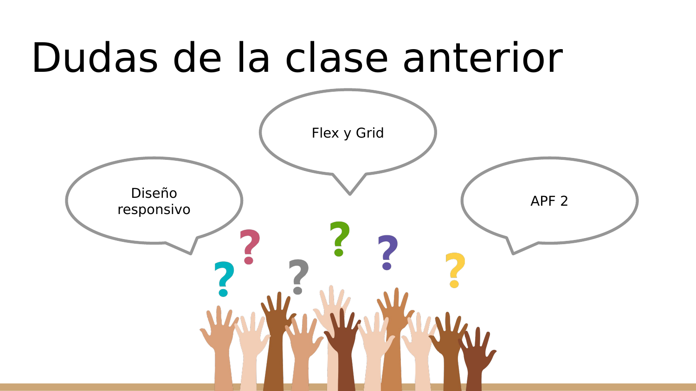

### Texto extraido

- Dudas de la clase anterior
- Diseño responsivo
- Flex y Grid
- APF 2

### Imagenes incrustadas extraidas

- [slide_002_image_01.png](S11-INTRODUCCION_A_JAVASCRIPT_assets/slide_002_image_01.png)

### Animaciones/transiciones

El PPTX contiene informacion de timing/animacion en este slide. Markdown no puede reproducirla; se conserva el estado visual estatico en la imagen renderizada.

## Slide 3

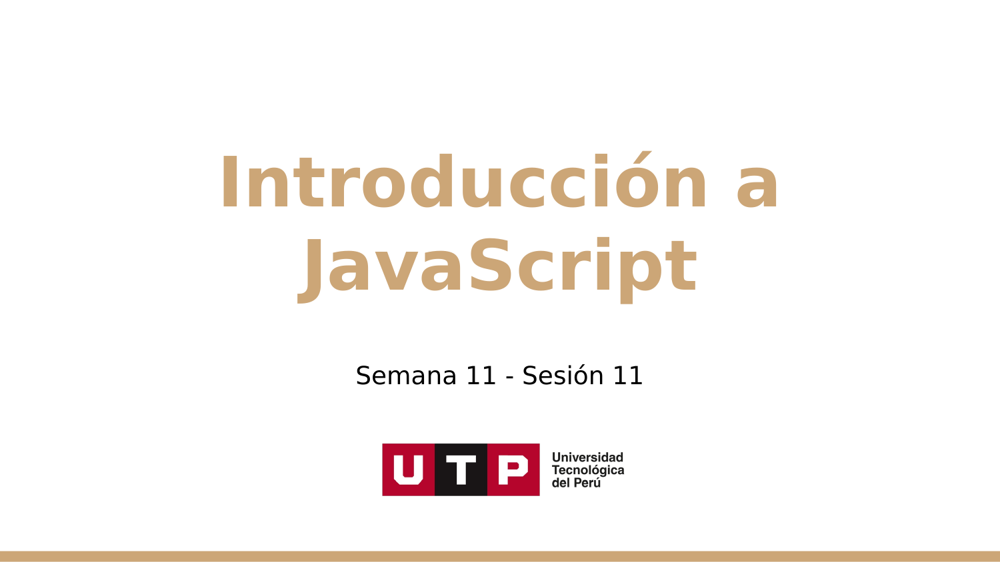

### Texto extraido

- Introducción a JavaScript
- Semana 11 - Sesión 11

### Imagenes incrustadas extraidas

- [slide_003_image_01.png](S11-INTRODUCCION_A_JAVASCRIPT_assets/slide_003_image_01.png)

## Slide 4

### Texto extraido

- Conocimientos previos

### Imagenes incrustadas extraidas

- [slide_004_image_01.png](S11-INTRODUCCION_A_JAVASCRIPT_assets/slide_004_image_01.png)
- [slide_004_image_02.png](S11-INTRODUCCION_A_JAVASCRIPT_assets/slide_004_image_02.png)
- [slide_004_image_03.png](S11-INTRODUCCION_A_JAVASCRIPT_assets/slide_004_image_03.png)

### Animaciones/transiciones

El PPTX contiene informacion de timing/animacion en este slide. Markdown no puede reproducirla; se conserva el estado visual estatico en la imagen renderizada.

## Slide 5

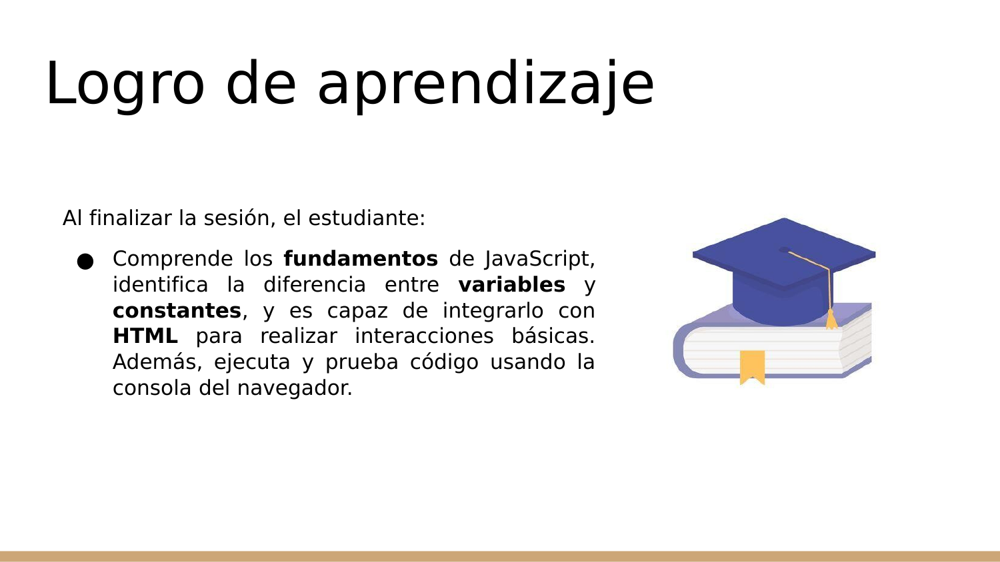

### Texto extraido

- Logro de aprendizaje
- Al finalizar la sesión, el estudiante:
- Comprende los fundamentos de JavaScript, identifica la diferencia entre variables y constantes, y es capaz de integrarlo con HTML para realizar interacciones básicas. Además, ejecuta y prueba código usando la consola del navegador.

### Imagenes incrustadas extraidas

- [slide_005_image_01.jpg](S11-INTRODUCCION_A_JAVASCRIPT_assets/slide_005_image_01.jpg)

## Slide 6

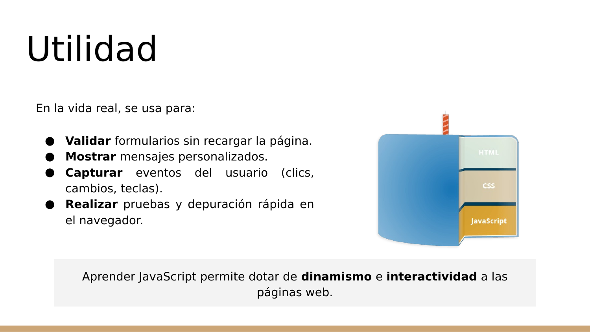

### Texto extraido

- Validar formularios sin recargar la página.
- Mostrar mensajes personalizados.
- Capturar eventos del usuario (clics, cambios, teclas).
- Realizar pruebas y depuración rápida en el navegador.
- Utilidad
- En la vida real, se usa para:
- Aprender JavaScript permite dotar de dinamismo e interactividad a las páginas web.

### Imagenes incrustadas extraidas

- [slide_006_image_01.png](S11-INTRODUCCION_A_JAVASCRIPT_assets/slide_006_image_01.png)

### Animaciones/transiciones

El PPTX contiene informacion de timing/animacion en este slide. Markdown no puede reproducirla; se conserva el estado visual estatico en la imagen renderizada.

## Slide 7

### Texto extraido

- Contenido
- Introducción a Javascript
- Variables y constantes
- Eventos con HTML
- Práctica

## Slide 8

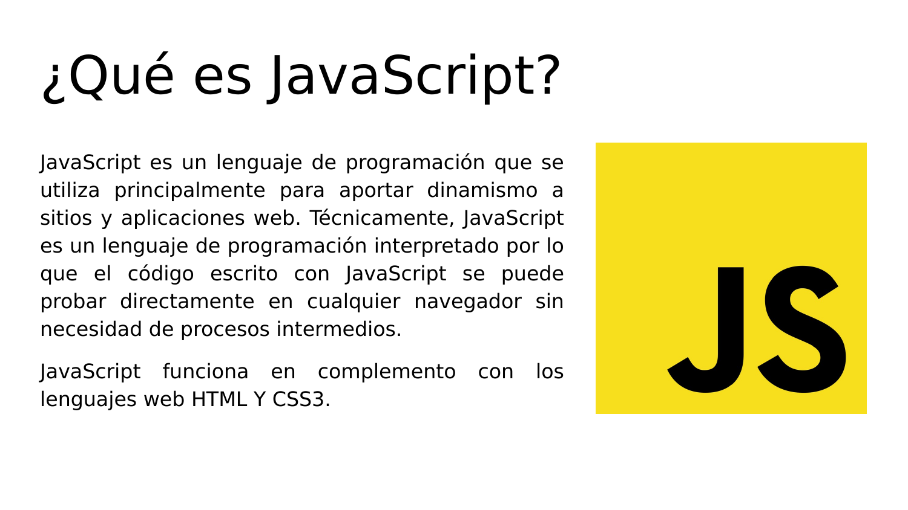

### Texto extraido

- ¿Qué es JavaScript?
- JavaScript es un lenguaje de programación que se utiliza principalmente para aportar dinamismo a sitios y aplicaciones web. Técnicamente, JavaScript es un lenguaje de programación interpretado por lo que el código escrito con JavaScript se puede probar directamente en cualquier navegador sin necesidad de procesos intermedios.
- JavaScript funciona en complemento con los lenguajes web HTML Y CSS3.

### Imagenes incrustadas extraidas

- [slide_008_image_01.png](S11-INTRODUCCION_A_JAVASCRIPT_assets/slide_008_image_01.png)

## Slide 9

### Texto extraido

- Introduction to JavaScript - 1

## Slide 10

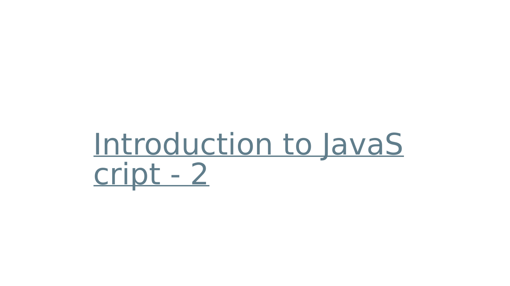

### Texto extraido

- Introduction to JavaScript - 2

## Slide 11

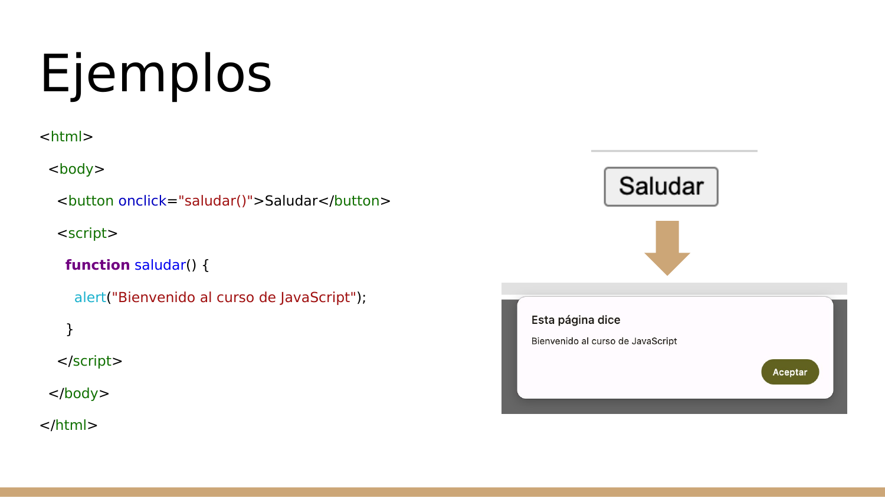

### Texto extraido

- Ejemplos
- <html>
- <body>
- <button onclick="saludar()">Saludar</button>
- 
- </body>
- </html>

### Imagenes incrustadas extraidas

- [slide_011_image_01.png](S11-INTRODUCCION_A_JAVASCRIPT_assets/slide_011_image_01.png)
- [slide_011_image_02.png](S11-INTRODUCCION_A_JAVASCRIPT_assets/slide_011_image_02.png)

### Animaciones/transiciones

El PPTX contiene informacion de timing/animacion en este slide. Markdown no puede reproducirla; se conserva el estado visual estatico en la imagen renderizada.

## Slide 12

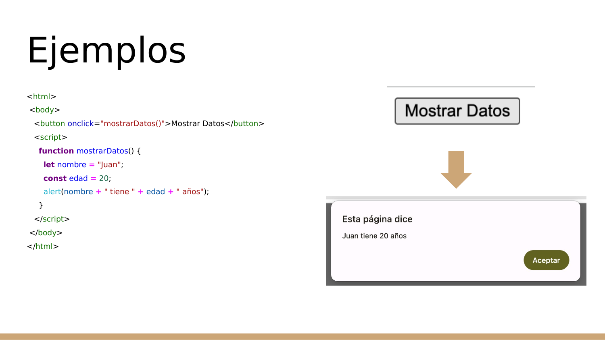

### Texto extraido

- Ejemplos
- <html>
- <body>
- <button onclick="mostrarDatos()">Mostrar Datos</button>
- 
- </body>
- </html>

### Imagenes incrustadas extraidas

- [slide_012_image_01.png](S11-INTRODUCCION_A_JAVASCRIPT_assets/slide_012_image_01.png)
- [slide_012_image_02.png](S11-INTRODUCCION_A_JAVASCRIPT_assets/slide_012_image_02.png)

### Animaciones/transiciones

El PPTX contiene informacion de timing/animacion en este slide. Markdown no puede reproducirla; se conserva el estado visual estatico en la imagen renderizada.

## Slide 13

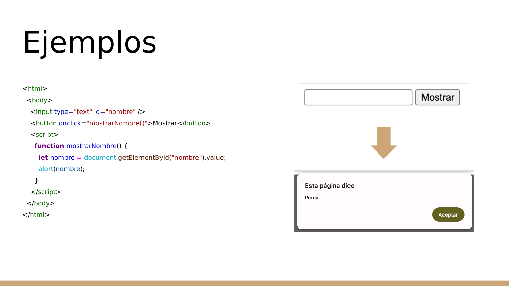

### Texto extraido

- Ejemplos
- <html>
- <body>
- <input type="text" id="nombre" />
- <button onclick="mostrarNombre()">Mostrar</button>
- 
- </body>
- </html>

### Imagenes incrustadas extraidas

- [slide_013_image_01.png](S11-INTRODUCCION_A_JAVASCRIPT_assets/slide_013_image_01.png)
- [slide_013_image_02.png](S11-INTRODUCCION_A_JAVASCRIPT_assets/slide_013_image_02.png)

### Animaciones/transiciones

El PPTX contiene informacion de timing/animacion en este slide. Markdown no puede reproducirla; se conserva el estado visual estatico en la imagen renderizada.

## Slide 14

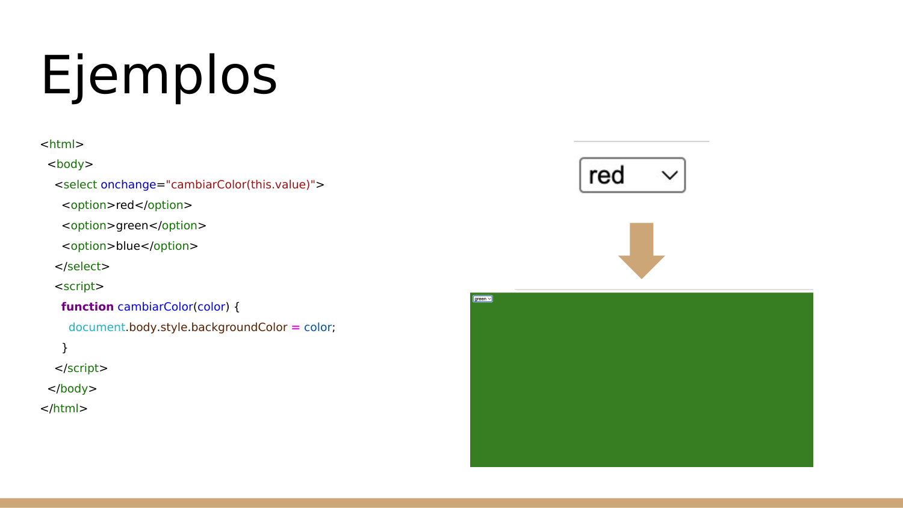

### Texto extraido

- Ejemplos
- <html>
- <body>
- <select onchange="cambiarColor(this.value)">
- <option>red</option>
- <option>green</option>
- <option>blue</option>
- </select>
- 
- </body>
- </html>

### Imagenes incrustadas extraidas

- [slide_014_image_01.png](S11-INTRODUCCION_A_JAVASCRIPT_assets/slide_014_image_01.png)
- [slide_014_image_02.png](S11-INTRODUCCION_A_JAVASCRIPT_assets/slide_014_image_02.png)

### Animaciones/transiciones

El PPTX contiene informacion de timing/animacion en este slide. Markdown no puede reproducirla; se conserva el estado visual estatico en la imagen renderizada.

## Slide 15

### Texto extraido

- Preguntas

### Imagenes incrustadas extraidas

- [slide_015_image_01.png](S11-INTRODUCCION_A_JAVASCRIPT_assets/slide_015_image_01.png)

## Slide 16

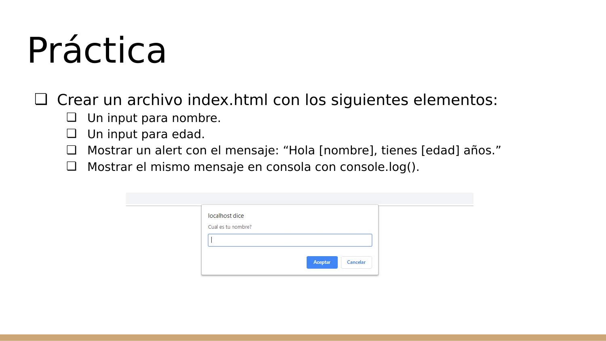

### Texto extraido

- Crear un archivo index.html con los siguientes elementos:
- Un input para nombre.
- Un input para edad.
- Mostrar un alert con el mensaje: “Hola [nombre], tienes [edad] años.”
- Mostrar el mismo mensaje en consola con console.log().
- Práctica

### Imagenes incrustadas extraidas

- [slide_016_image_01.png](S11-INTRODUCCION_A_JAVASCRIPT_assets/slide_016_image_01.png)

## Slide 17

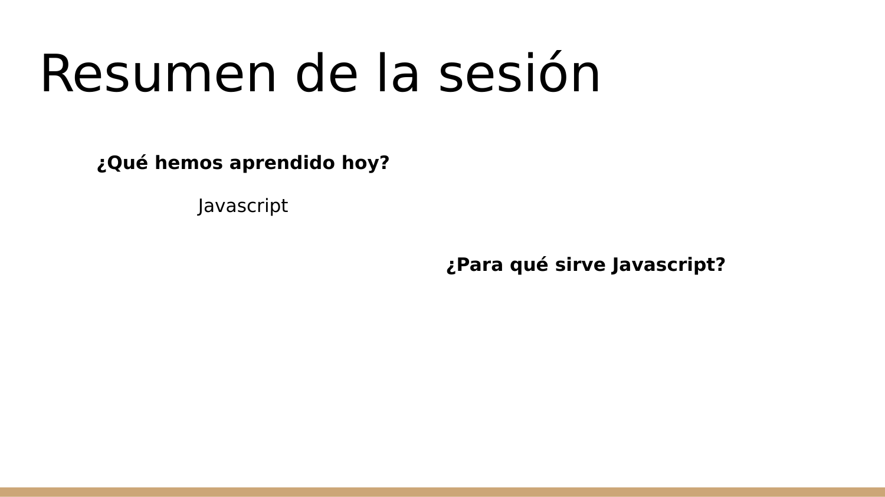

### Texto extraido

- Resumen de la sesión
- ¿Qué hemos aprendido hoy?
- Javascript
- ¿Para qué sirve Javascript?

### Animaciones/transiciones

El PPTX contiene informacion de timing/animacion en este slide. Markdown no puede reproducirla; se conserva el estado visual estatico en la imagen renderizada.

## Slide 18

### Texto extraido

- ¡Gracias!

## Slide 19

### Texto extraido

- TALLER DE PROGRAMACIÓN WEB
- M.Sc. Jesamin Zevallos Quispe
- c29741@utp.edu.pe

### Imagenes incrustadas extraidas

- [slide_019_image_01.png](S11-INTRODUCCION_A_JAVASCRIPT_assets/slide_019_image_01.png)
