# S12_s12 - Introducción a JavaScript II_pptx

- Fuente original: `S12_s12 - Introducción a JavaScript II_pptx.pdf`
- Archivo Markdown: `S12_s12_-Introduccion_a_JavaScript_II_pptx.md`
- Metodo: texto extraido desde PDF seleccionable con `pdftotext` y captura completa de cada pagina.
- Criterio de fidelidad: los elementos no textuales, como imagenes, formas, graficos, tablas dibujadas e iconos, quedan conservados en la imagen completa de la pagina.

## Pagina 1


### Texto extraido

```text
TALLER DE
PROGRAMACIÓN
 WEB
M.Sc. Jesamin Zevallos Quispe
 c29741@utp.edu.pe
```

## Pagina 2

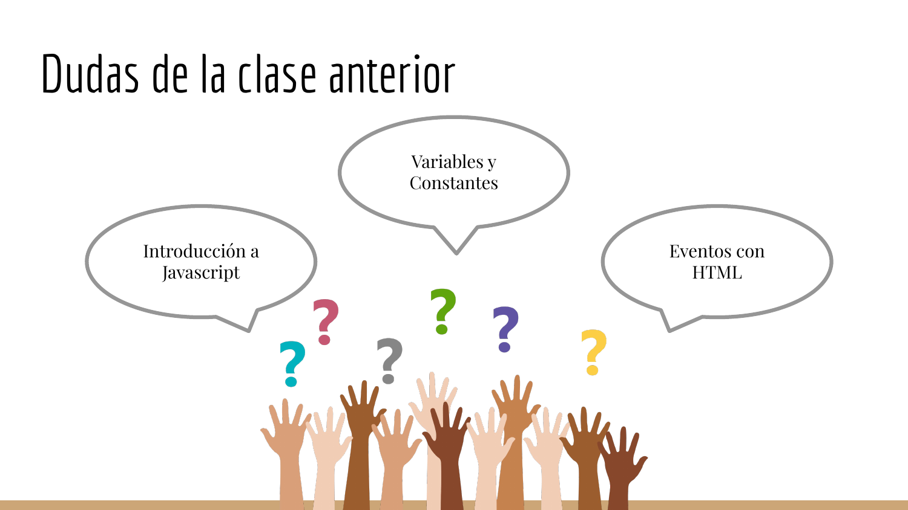

### Texto extraido

```text
Dudas de la clase anterior
 Variables y
 Constantes

 Introducción a Eventos con
 Javascript HTML
```

## Pagina 3

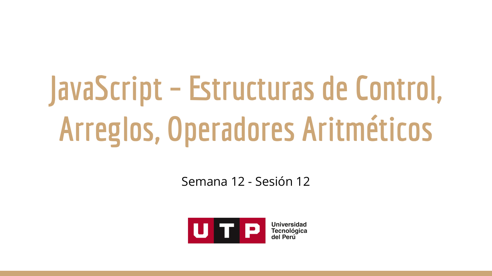

### Texto extraido

```text
JavaScript – Estructuras de Control,
 Arreglos, Operadores Aritméticos
 Semana 12 - Sesión 12
```

## Pagina 4


### Texto extraido

```text
Conocimientos previos
```

## Pagina 5

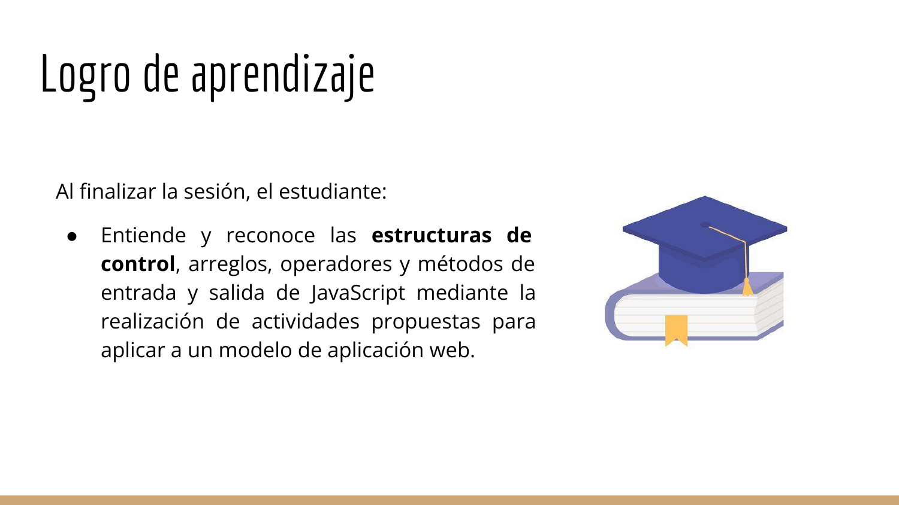

### Texto extraido

```text
Logro de aprendizaje

Al finalizar la sesión, el estudiante:

 ● Entiende y reconoce las estructuras de
 control, arreglos, operadores y métodos de
 entrada y salida de JavaScript mediante la
 realización de actividades propuestas para
 aplicar a un modelo de aplicación web.
```

## Pagina 6

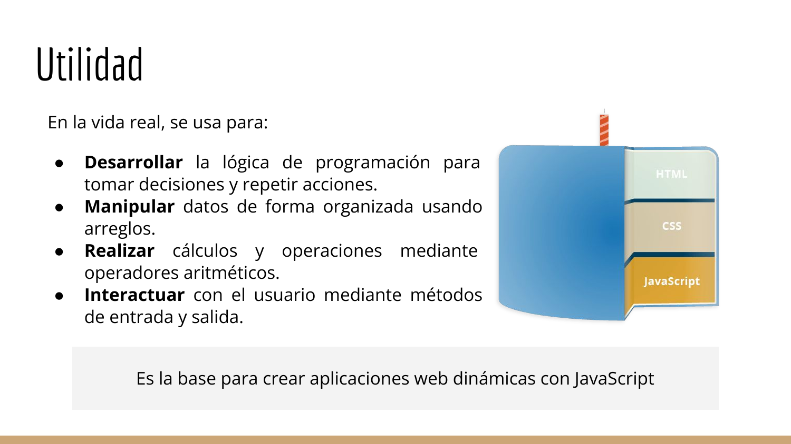

### Texto extraido

```text
Utilidad
En la vida real, se usa para:

 ● Desarrollar la lógica de programación para
 tomar decisiones y repetir acciones.
 ● Manipular datos de forma organizada usando
 arreglos.
 ● Realizar cálculos y operaciones mediante
 operadores aritméticos.
 ● Interactuar con el usuario mediante métodos
 de entrada y salida.

 Es la base para crear aplicaciones web dinámicas con JavaScript
```

## Pagina 7

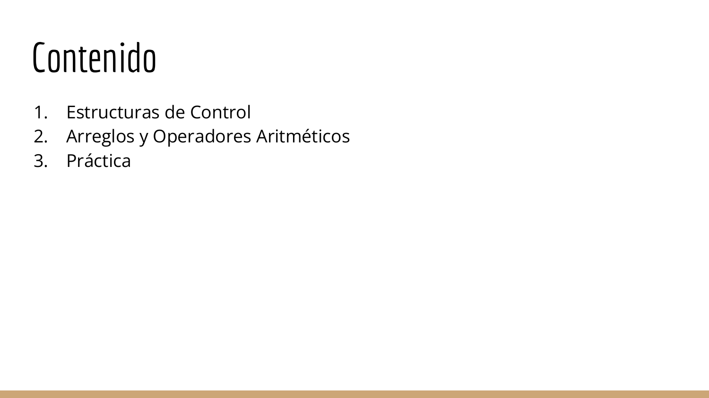

### Texto extraido

```text
Contenido
1. Estructuras de Control
2. Arreglos y Operadores Aritméticos
3. Práctica
```

## Pagina 8

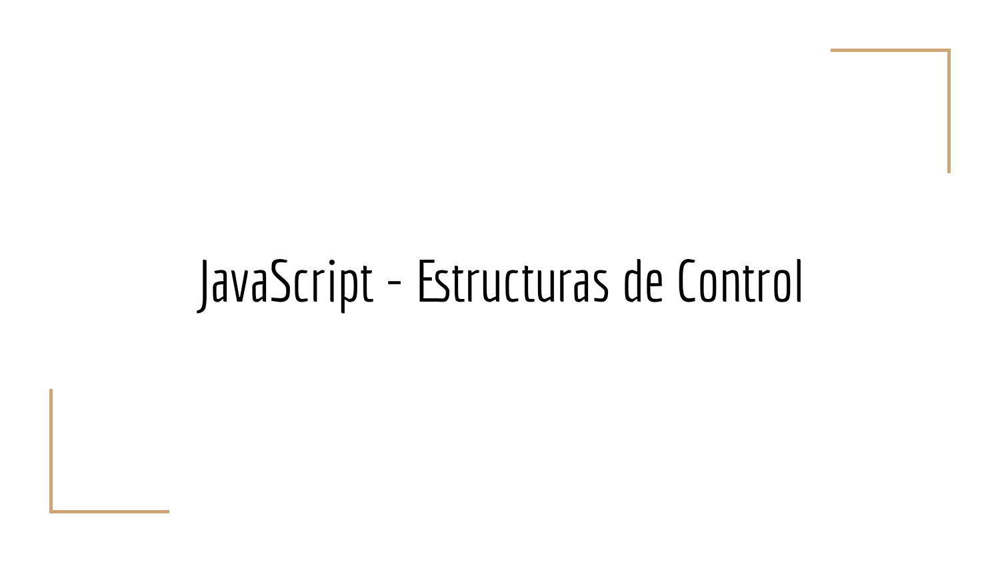

### Texto extraido

```text
JavaScript - Estructuras de Control
```

## Pagina 9

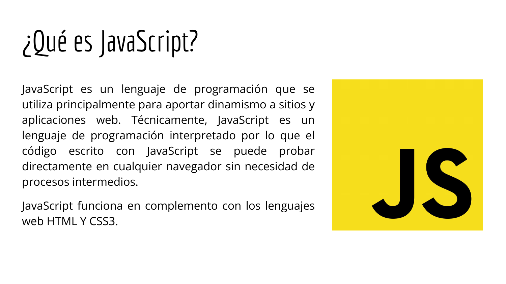

### Texto extraido

```text
¿Qué es JavaScript?
JavaScript es un lenguaje de programación que se
utiliza principalmente para aportar dinamismo a sitios y
aplicaciones web. Técnicamente, JavaScript es un
lenguaje de programación interpretado por lo que el
código escrito con JavaScript se puede probar
directamente en cualquier navegador sin necesidad de
procesos intermedios.

JavaScript funciona en complemento con los lenguajes
web HTML Y CSS3.
```

## Pagina 10

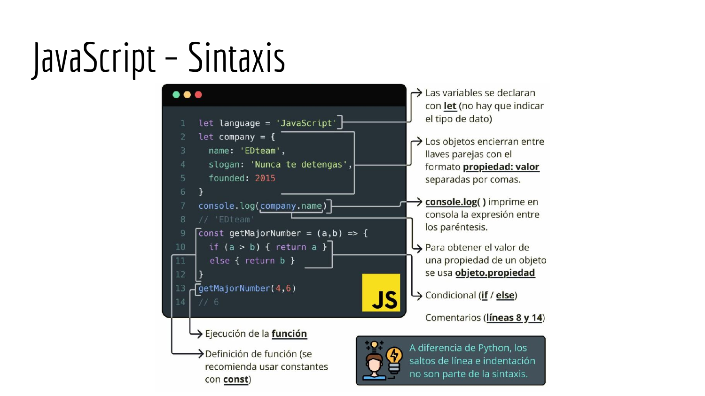

### Texto extraido

```text
JavaScript – Sintaxis
```

## Pagina 11

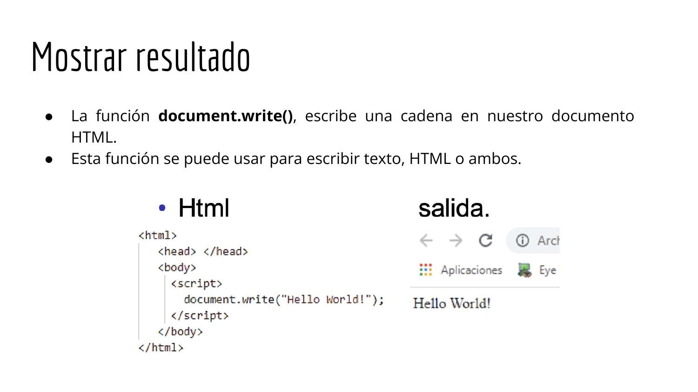

### Texto extraido

```text
Mostrar resultado
 ● La función document.write(), escribe una cadena en nuestro documento
 HTML.
 ● Esta función se puede usar para escribir texto, HTML o ambos.
```

## Pagina 12

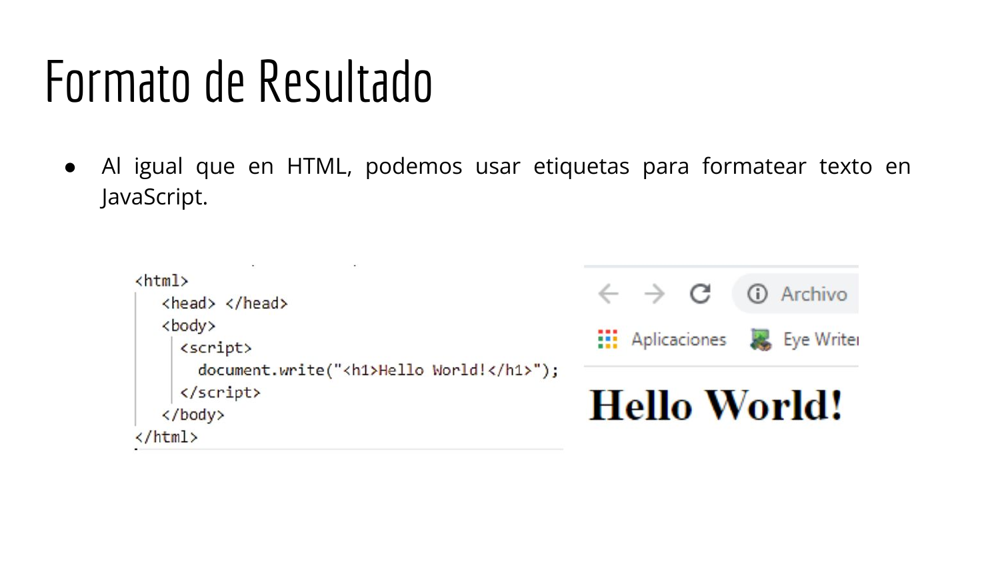

### Texto extraido

```text
Formato de Resultado
 ● Al igual que en HTML, podemos usar etiquetas para formatear texto en
 JavaScript.
```

## Pagina 13

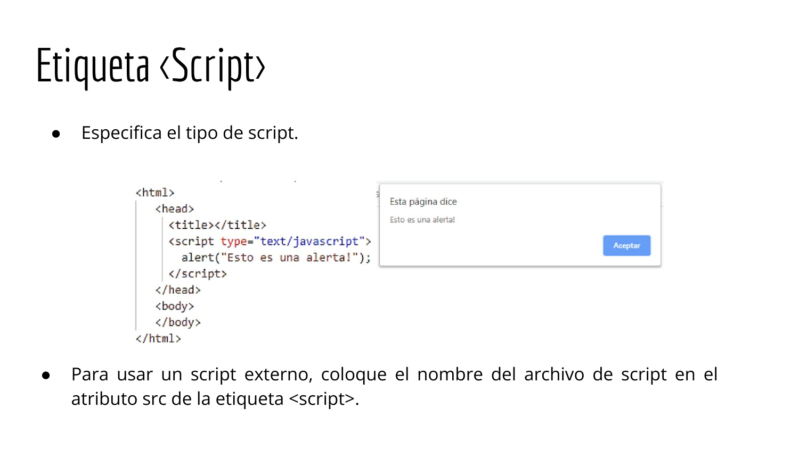

### Texto extraido

```text
Etiqueta <Script>
 ● Especifica el tipo de script.

● Para usar un script externo, coloque el nombre del archivo de script en el
 atributo src de la etiqueta <script>.
```

## Pagina 14

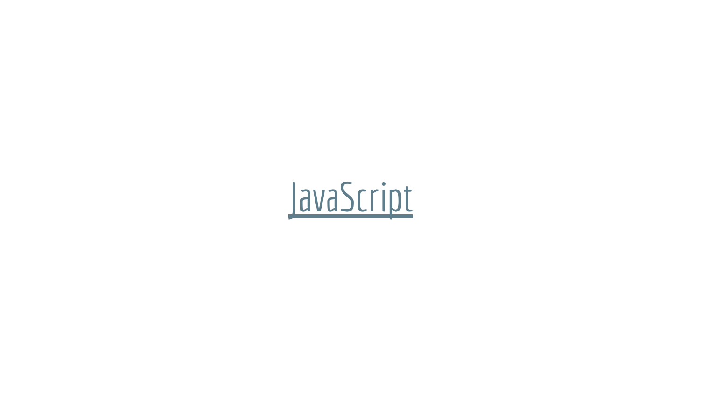

### Texto extraido

```text
JavaScript
```

## Pagina 15


### Texto extraido

```text
Preguntas
```

## Pagina 16

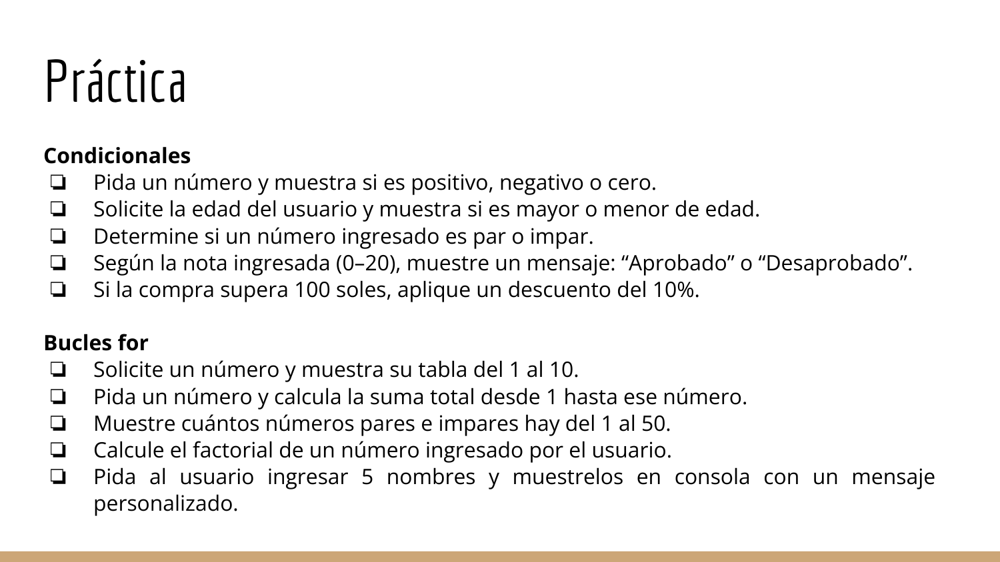

### Texto extraido

```text
Práctica
Condicionales
❏ Pida un número y muestra si es positivo, negativo o cero.
❏ Solicite la edad del usuario y muestra si es mayor o menor de edad.
❏ Determine si un número ingresado es par o impar.
❏ Según la nota ingresada (0–20), muestre un mensaje: “Aprobado” o “Desaprobado”.
❏ Si la compra supera 100 soles, aplique un descuento del 10%.

Bucles for
❏ Solicite un número y muestra su tabla del 1 al 10.
❏ Pida un número y calcula la suma total desde 1 hasta ese número.
❏ Muestre cuántos números pares e impares hay del 1 al 50.
❏ Calcule el factorial de un número ingresado por el usuario.
❏ Pida al usuario ingresar 5 nombres y muestrelos en consola con un mensaje
 personalizado.
```

## Pagina 17

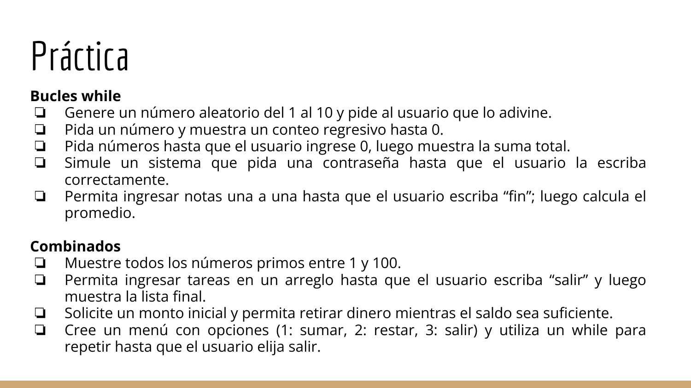

### Texto extraido

```text
Práctica
Bucles while
❏ Genere un número aleatorio del 1 al 10 y pide al usuario que lo adivine.
❏ Pida un número y muestra un conteo regresivo hasta 0.
❏ Pida números hasta que el usuario ingrese 0, luego muestra la suma total.
❏ Simule un sistema que pida una contraseña hasta que el usuario la escriba
 correctamente.
❏ Permita ingresar notas una a una hasta que el usuario escriba “fin”; luego calcula el
 promedio.

Combinados
❏ Muestre todos los números primos entre 1 y 100.
❏ Permita ingresar tareas en un arreglo hasta que el usuario escriba “salir” y luego
 muestra la lista final.
❏ Solicite un monto inicial y permita retirar dinero mientras el saldo sea suficiente.
❏ Cree un menú con opciones (1: sumar, 2: restar, 3: salir) y utiliza un while para
 repetir hasta que el usuario elija salir.
```

## Pagina 18

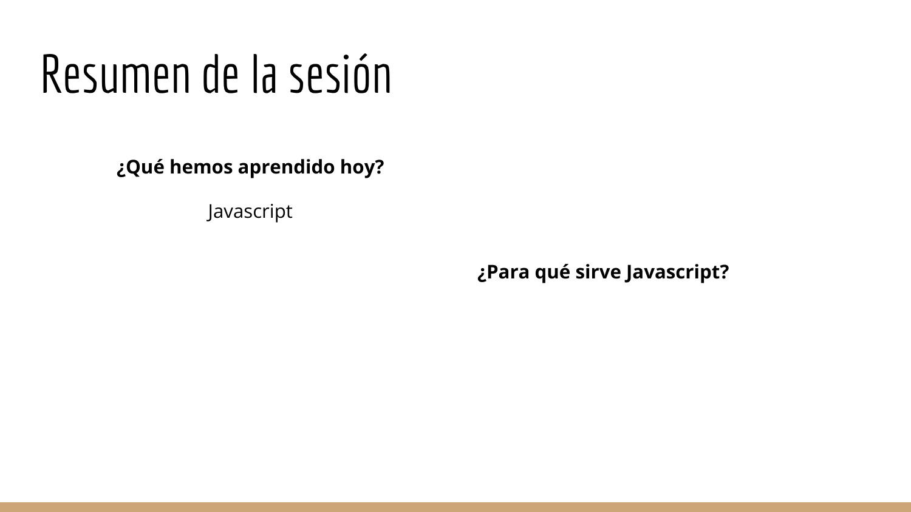

### Texto extraido

```text
Resumen de la sesión
 ¿Qué hemos aprendido hoy?

 Javascript

 ¿Para qué sirve Javascript?
```

## Pagina 19


### Texto extraido

```text
¡Gracias!
```

## Pagina 20


### Texto extraido

```text
TALLER DE
PROGRAMACIÓN
 WEB
M.Sc. Jesamin Zevallos Quispe
 c29741@utp.edu.pe
```

## Imagenes extraidas del PDF

Estas imagenes fueron extraidas como archivos independientes del PDF. La ubicacion exacta por pagina puede depender de la estructura interna del documento, por eso la referencia principal sigue siendo la captura completa de cada pagina.

- [imagen-000.png](S12_s12_-Introduccion_a_JavaScript_II_pptx_assets/imagenes_extraidas_pdf/imagen-000.png)
- [imagen-001.png](S12_s12_-Introduccion_a_JavaScript_II_pptx_assets/imagenes_extraidas_pdf/imagen-001.png)
- [imagen-002.png](S12_s12_-Introduccion_a_JavaScript_II_pptx_assets/imagenes_extraidas_pdf/imagen-002.png)
- [imagen-003.png](S12_s12_-Introduccion_a_JavaScript_II_pptx_assets/imagenes_extraidas_pdf/imagen-003.png)
- [imagen-004.png](S12_s12_-Introduccion_a_JavaScript_II_pptx_assets/imagenes_extraidas_pdf/imagen-004.png)
- [imagen-005.png](S12_s12_-Introduccion_a_JavaScript_II_pptx_assets/imagenes_extraidas_pdf/imagen-005.png)
- [imagen-006.png](S12_s12_-Introduccion_a_JavaScript_II_pptx_assets/imagenes_extraidas_pdf/imagen-006.png)
- [imagen-007.png](S12_s12_-Introduccion_a_JavaScript_II_pptx_assets/imagenes_extraidas_pdf/imagen-007.png)
- [imagen-008.png](S12_s12_-Introduccion_a_JavaScript_II_pptx_assets/imagenes_extraidas_pdf/imagen-008.png)
- [imagen-009.png](S12_s12_-Introduccion_a_JavaScript_II_pptx_assets/imagenes_extraidas_pdf/imagen-009.png)
- [imagen-010.png](S12_s12_-Introduccion_a_JavaScript_II_pptx_assets/imagenes_extraidas_pdf/imagen-010.png)
- [imagen-011.png](S12_s12_-Introduccion_a_JavaScript_II_pptx_assets/imagenes_extraidas_pdf/imagen-011.png)
- [imagen-012.png](S12_s12_-Introduccion_a_JavaScript_II_pptx_assets/imagenes_extraidas_pdf/imagen-012.png)
- [imagen-013.png](S12_s12_-Introduccion_a_JavaScript_II_pptx_assets/imagenes_extraidas_pdf/imagen-013.png)
- [imagen-014.png](S12_s12_-Introduccion_a_JavaScript_II_pptx_assets/imagenes_extraidas_pdf/imagen-014.png)
- [imagen-015.png](S12_s12_-Introduccion_a_JavaScript_II_pptx_assets/imagenes_extraidas_pdf/imagen-015.png)
- [imagen-016.png](S12_s12_-Introduccion_a_JavaScript_II_pptx_assets/imagenes_extraidas_pdf/imagen-016.png)
- [imagen-017.png](S12_s12_-Introduccion_a_JavaScript_II_pptx_assets/imagenes_extraidas_pdf/imagen-017.png)
- [imagen-018.png](S12_s12_-Introduccion_a_JavaScript_II_pptx_assets/imagenes_extraidas_pdf/imagen-018.png)
- [imagen-019.png](S12_s12_-Introduccion_a_JavaScript_II_pptx_assets/imagenes_extraidas_pdf/imagen-019.png)
- [imagen-020.png](S12_s12_-Introduccion_a_JavaScript_II_pptx_assets/imagenes_extraidas_pdf/imagen-020.png)
