# S13_s13 - Introducción al DOM

- Fuente original: `S13_s13 - Introducción al DOM.pptx`
- Archivo Markdown: `S13_s13_-Introduccion_al_DOM.md`
- Metodo: texto extraido desde el XML del PPTX y captura completa de cada slide renderizada con LibreOffice.
- Criterio de fidelidad: los elementos no textuales, como imagenes, formas, graficos, tablas dibujadas e iconos, quedan conservados en la imagen completa del slide.

## Slide 1

### Texto extraido

- TALLER DE PROGRAMACIÓN WEB
- M.Sc. Jesamin Zevallos Quispe
- c29741@utp.edu.pe

### Imagenes incrustadas extraidas

- [slide_001_image_01.png](S13_s13_-Introduccion_al_DOM_assets/slide_001_image_01.png)

## Slide 2

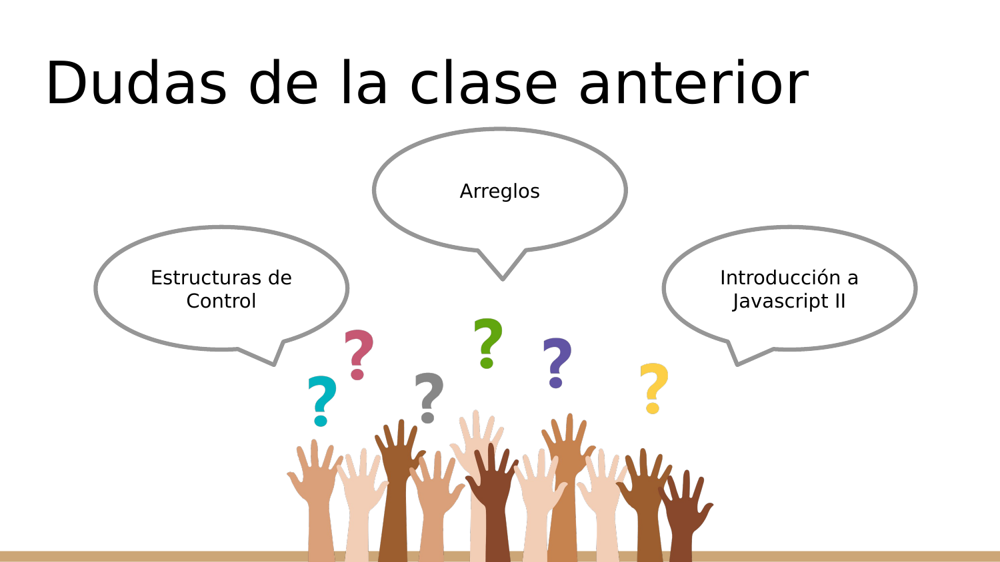

### Texto extraido

- Dudas de la clase anterior
- Estructuras de Control
- Arreglos
- Introducción a Javascript II

### Imagenes incrustadas extraidas

- [slide_002_image_01.png](S13_s13_-Introduccion_al_DOM_assets/slide_002_image_01.png)

### Animaciones/transiciones

El PPTX contiene informacion de timing/animacion en este slide. Markdown no puede reproducirla; se conserva el estado visual estatico en la imagen renderizada.

## Slide 3

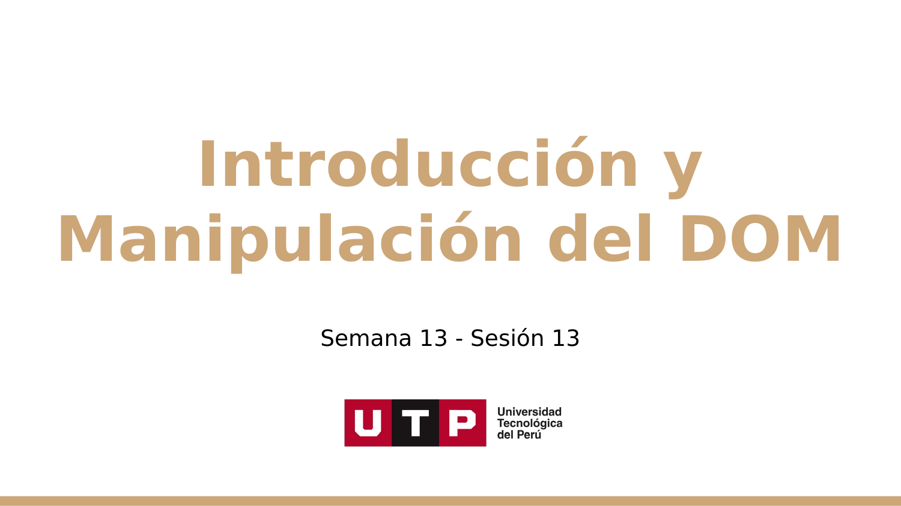

### Texto extraido

- Introducción y Manipulación del DOM
- Semana 13 - Sesión 13

### Imagenes incrustadas extraidas

- [slide_003_image_01.png](S13_s13_-Introduccion_al_DOM_assets/slide_003_image_01.png)

## Slide 4

### Texto extraido

- Conocimientos previos

### Imagenes incrustadas extraidas

- [slide_004_image_01.png](S13_s13_-Introduccion_al_DOM_assets/slide_004_image_01.png)
- [slide_004_image_02.png](S13_s13_-Introduccion_al_DOM_assets/slide_004_image_02.png)
- [slide_004_image_03.png](S13_s13_-Introduccion_al_DOM_assets/slide_004_image_03.png)

### Animaciones/transiciones

El PPTX contiene informacion de timing/animacion en este slide. Markdown no puede reproducirla; se conserva el estado visual estatico en la imagen renderizada.

## Slide 5

### Texto extraido

- Logro de aprendizaje
- Al finalizar la sesión, el estudiante:
- Comprende qué es DOM y cómo interactuar con los elementos HTML desde JavaScript mediante el objeto document. Será capaz de acceder, modificar y crear contenido dinámico en una página web.

### Imagenes incrustadas extraidas

- [slide_005_image_01.jpg](S13_s13_-Introduccion_al_DOM_assets/slide_005_image_01.jpg)

## Slide 6

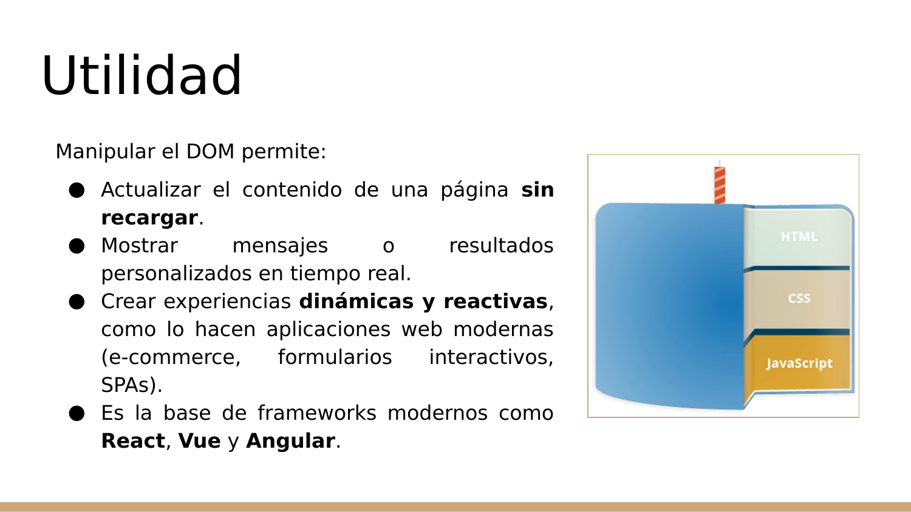

### Texto extraido

- Actualizar el contenido de una página sin recargar.
- Mostrar mensajes o resultados personalizados en tiempo real.
- Crear experiencias dinámicas y reactivas, como lo hacen aplicaciones web modernas (e-commerce, formularios interactivos, SPAs).
- Es la base de frameworks modernos como React, Vue y Angular.
- Utilidad
- Manipular el DOM permite:

### Imagenes incrustadas extraidas

- [slide_006_image_01.png](S13_s13_-Introduccion_al_DOM_assets/slide_006_image_01.png)

## Slide 7

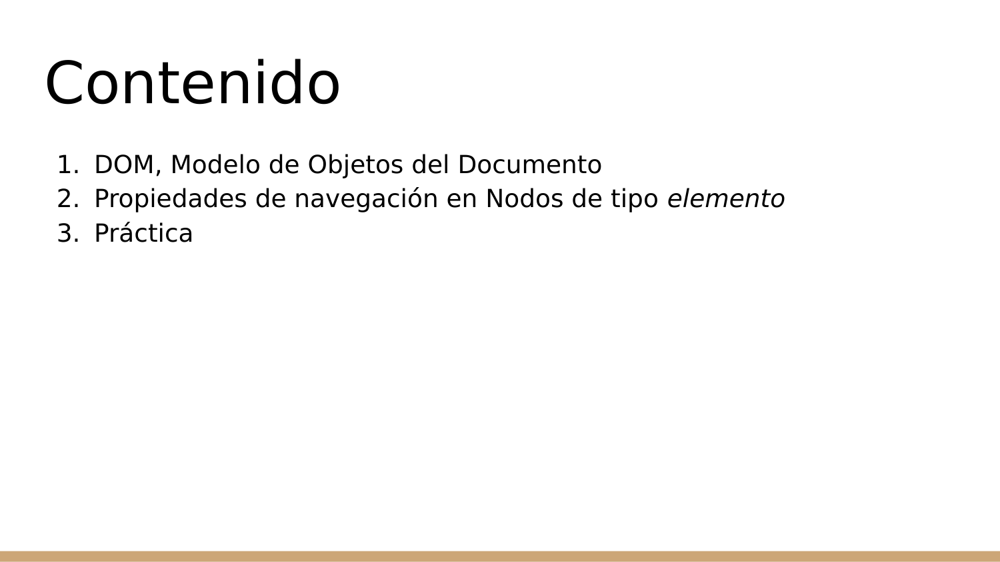

### Texto extraido

- Contenido
- DOM, Modelo de Objetos del Documento
- Propiedades de navegación en Nodos de tipo elemento
- Práctica

## Slide 8

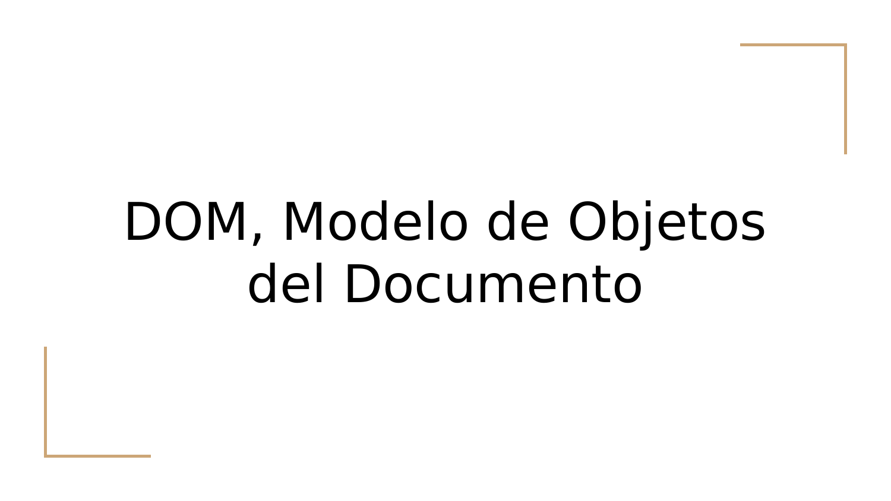

### Texto extraido

- DOM, Modelo de Objetos del Documento

## Slide 9

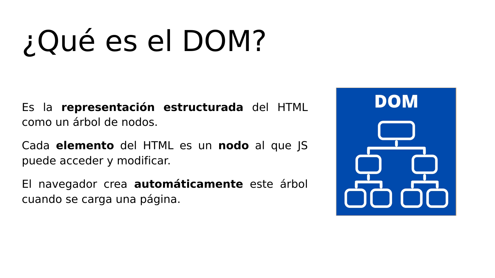

### Texto extraido

- ¿Qué es el DOM?
- Es la representación estructurada del HTML como un árbol de nodos.
- Cada elemento del HTML es un nodo al que JS puede acceder y modificar.
- El navegador crea automáticamente este árbol cuando se carga una página.

### Imagenes incrustadas extraidas

- [slide_009_image_01.png](S13_s13_-Introduccion_al_DOM_assets/slide_009_image_01.png)

## Slide 10

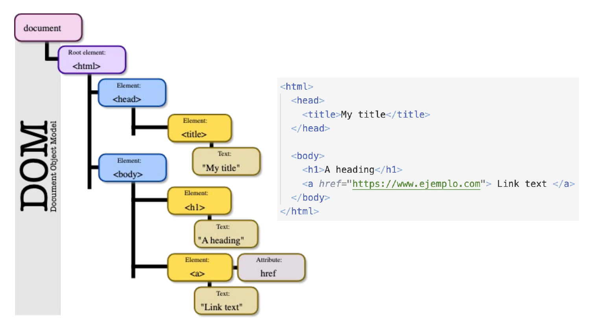

### Texto extraido

No se detecto texto editable en el XML del slide. Revisar la imagen completa del slide para el contenido visual.

### Imagenes incrustadas extraidas

- [slide_010_image_01.png](S13_s13_-Introduccion_al_DOM_assets/slide_010_image_01.png)
- [slide_010_image_02.png](S13_s13_-Introduccion_al_DOM_assets/slide_010_image_02.png)

## Slide 11

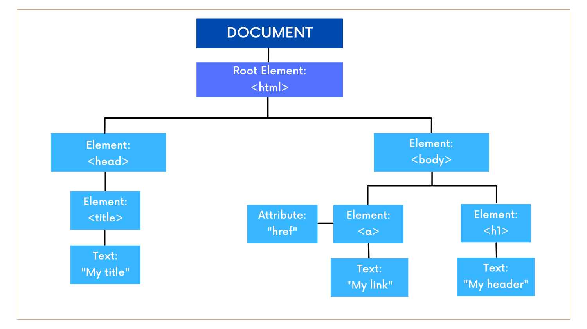

### Texto extraido

No se detecto texto editable en el XML del slide. Revisar la imagen completa del slide para el contenido visual.

### Imagenes incrustadas extraidas

- [slide_011_image_01.png](S13_s13_-Introduccion_al_DOM_assets/slide_011_image_01.png)

## Slide 12

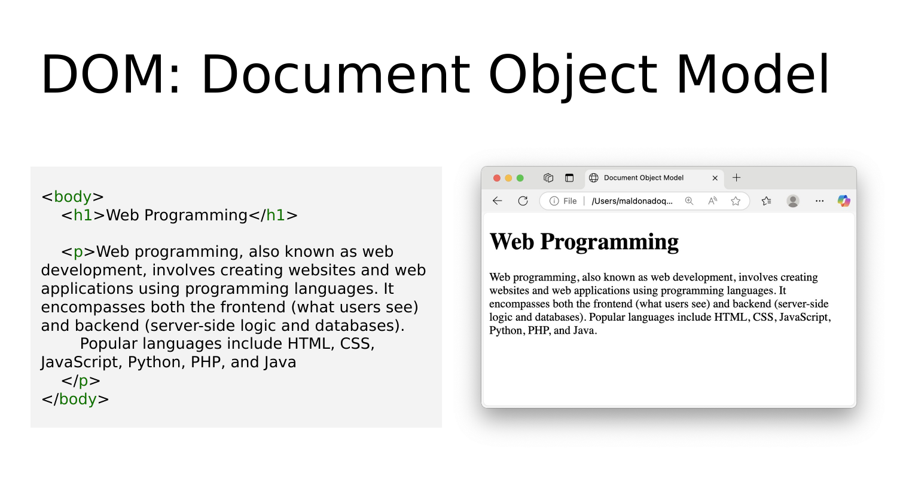

### Texto extraido

- DOM: Document Object Model
- <body>
- <h1>Web Programming</h1>
- 
Web programming, also known as web development, involves creating websites and web applications using programming languages. It encompasses both the frontend (what users see) and backend (server-side logic and databases).
- Popular languages include HTML, CSS, JavaScript, Python, PHP, and Java
- 

- </body>

### Imagenes incrustadas extraidas

- [slide_012_image_01.png](S13_s13_-Introduccion_al_DOM_assets/slide_012_image_01.png)

### Animaciones/transiciones

El PPTX contiene informacion de timing/animacion en este slide. Markdown no puede reproducirla; se conserva el estado visual estatico en la imagen renderizada.

## Slide 13

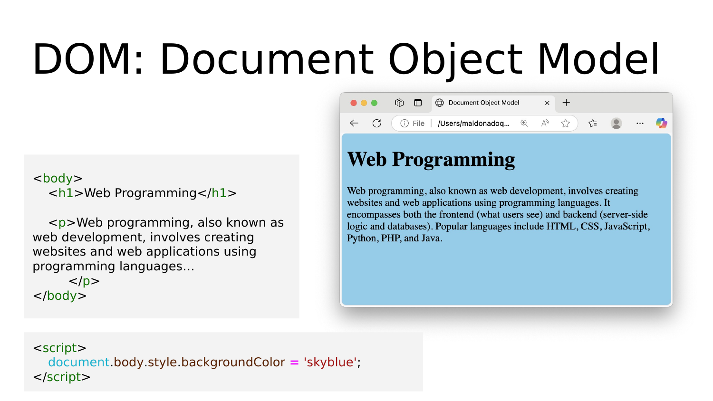

### Texto extraido

- DOM: Document Object Model
- <body>
- <h1>Web Programming</h1>
- 
Web programming, also known as web development, involves creating websites and web applications using programming languages…
- 

- </body>
- 

### Imagenes incrustadas extraidas

- [slide_013_image_01.png](S13_s13_-Introduccion_al_DOM_assets/slide_013_image_01.png)

### Animaciones/transiciones

El PPTX contiene informacion de timing/animacion en este slide. Markdown no puede reproducirla; se conserva el estado visual estatico en la imagen renderizada.

## Slide 14

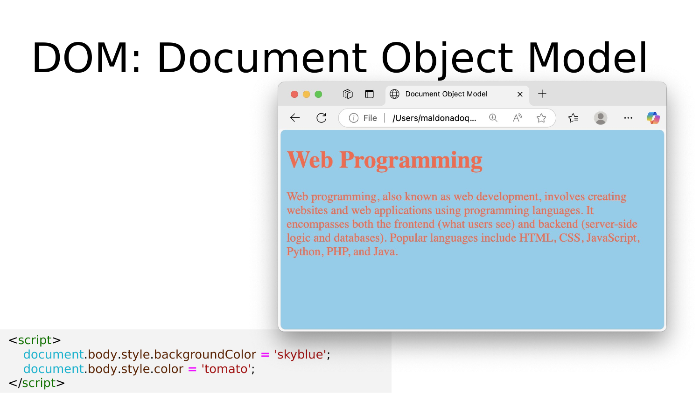

### Texto extraido

- DOM: Document Object Model
- 

### Imagenes incrustadas extraidas

- [slide_014_image_01.png](S13_s13_-Introduccion_al_DOM_assets/slide_014_image_01.png)

## Slide 15

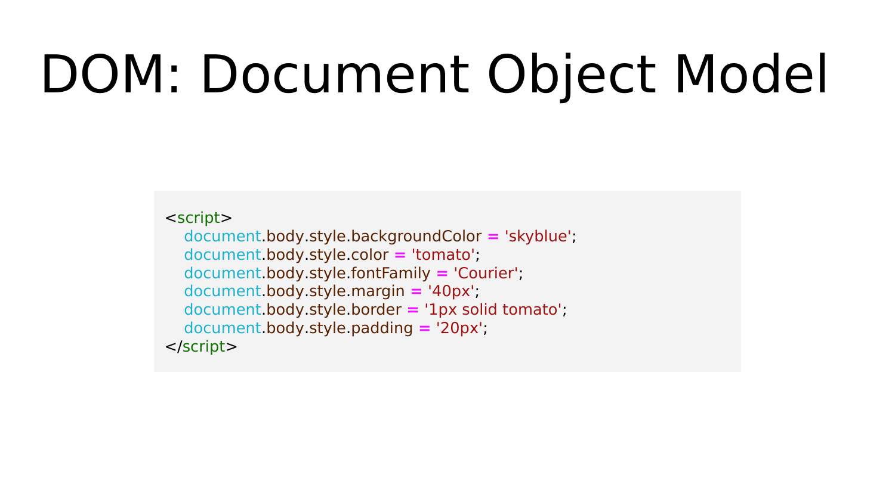

### Texto extraido

- DOM: Document Object Model
- 

## Slide 16

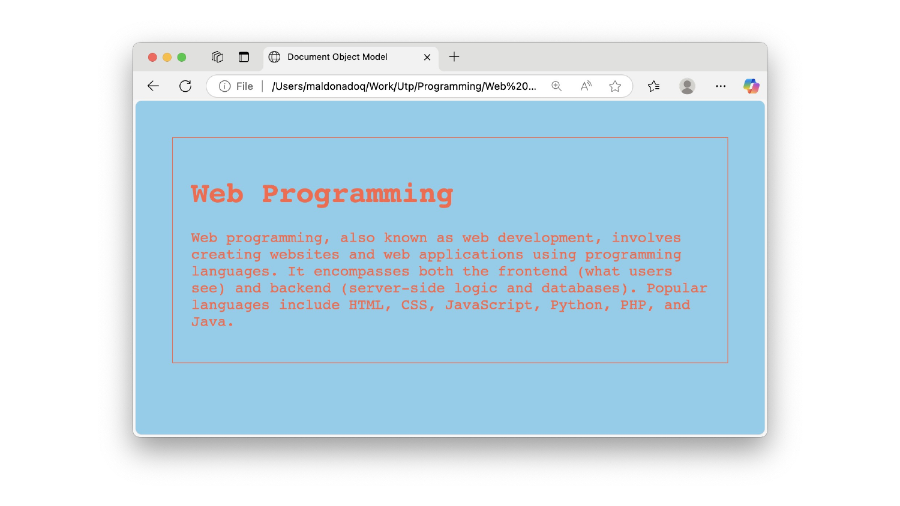

### Texto extraido

No se detecto texto editable en el XML del slide. Revisar la imagen completa del slide para el contenido visual.

### Imagenes incrustadas extraidas

- [slide_016_image_01.png](S13_s13_-Introduccion_al_DOM_assets/slide_016_image_01.png)

## Slide 17

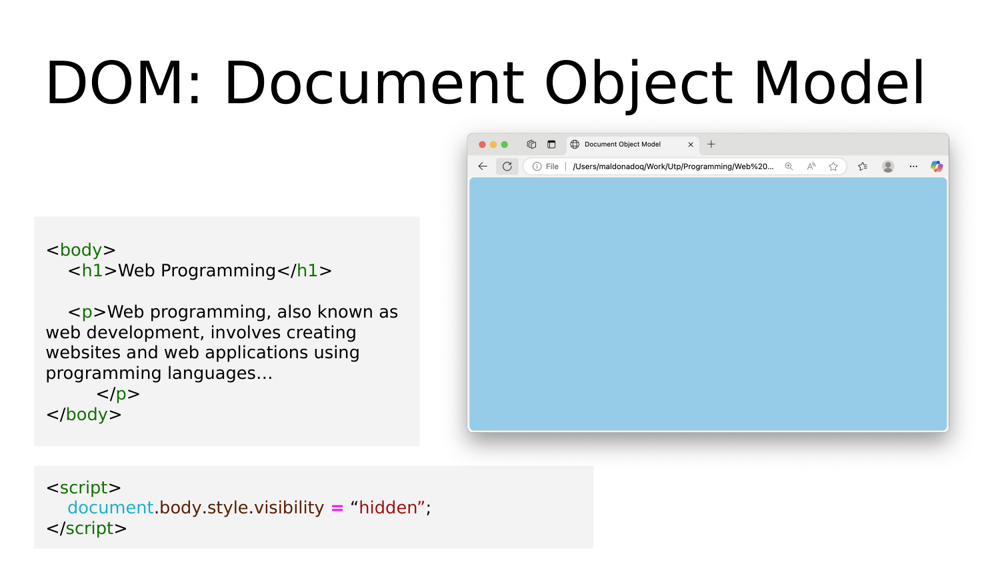

### Texto extraido

- DOM: Document Object Model
- <body>
- <h1>Web Programming</h1>
- 
Web programming, also known as web development, involves creating websites and web applications using programming languages…
- 

- </body>
- 

### Imagenes incrustadas extraidas

- [slide_017_image_01.png](S13_s13_-Introduccion_al_DOM_assets/slide_017_image_01.png)

### Animaciones/transiciones

El PPTX contiene informacion de timing/animacion en este slide. Markdown no puede reproducirla; se conserva el estado visual estatico en la imagen renderizada.

## Slide 18

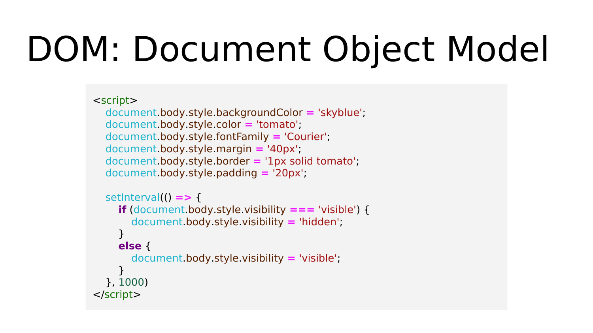

### Texto extraido

- DOM: Document Object Model
- 

## Slide 19

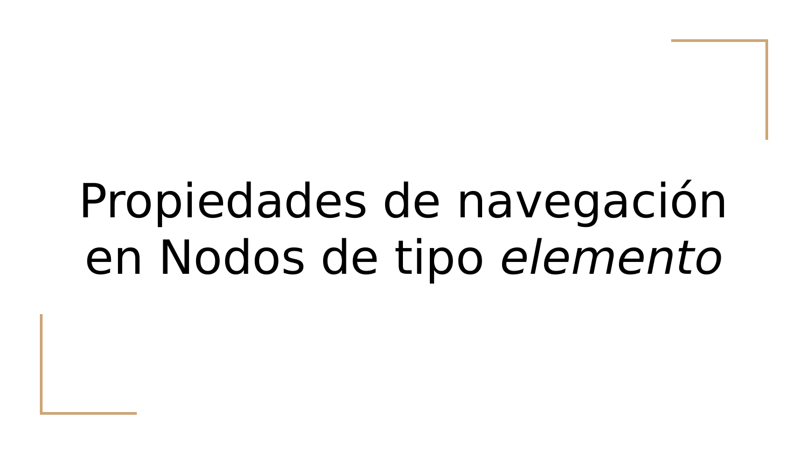

### Texto extraido

- Propiedades de navegación en Nodos de tipo elemento

## Slide 20

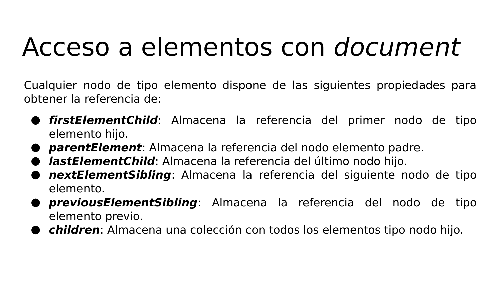

### Texto extraido

- Cualquier nodo de tipo elemento dispone de las siguientes propiedades para obtener la referencia de:
- firstElementChild: Almacena la referencia del primer nodo de tipo elemento hijo.
- parentElement: Almacena la referencia del nodo elemento padre.
- lastElementChild: Almacena la referencia del último nodo hijo.
- nextElementSibling: Almacena la referencia del siguiente nodo de tipo elemento.
- previousElementSibling: Almacena la referencia del nodo de tipo elemento previo.
- children: Almacena una colección con todos los elementos tipo nodo hijo.
- Acceso a elementos con document

## Slide 21

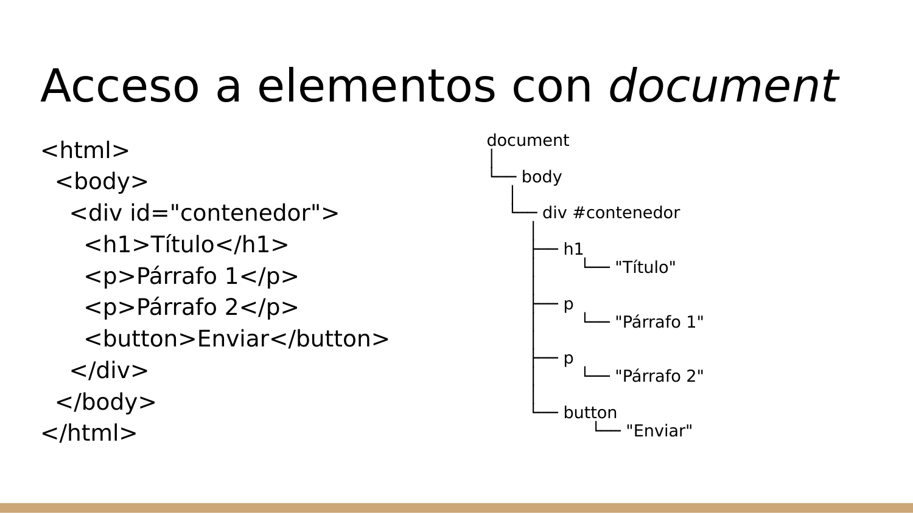

### Texto extraido

- Acceso a elementos con document
- <html>
- <body>
- 

- <h1>Título</h1>
- 
Párrafo 1

- 
Párrafo 2

- <button>Enviar</button>
- 

- </body>
- </html>
- document
- │
- └── body
- │
- └── div #contenedor
- │
- ├── h1
- │ └── "Título"
- │
- ├── p
- │ └── "Párrafo 1"
- │
- ├── p
- │ └── "Párrafo 2"
- │
- └── button
- └── "Enviar"

## Slide 22

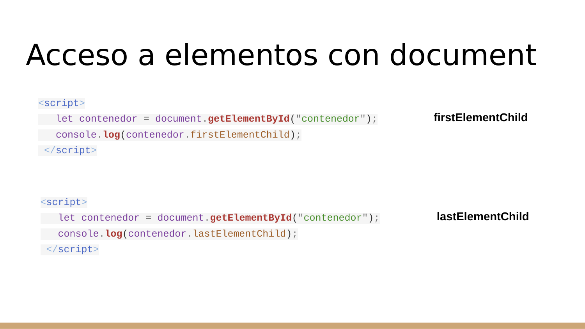

### Texto extraido

- Acceso a elementos con document
- 
- firstElementChild
- 
- lastElementChild

## Slide 23

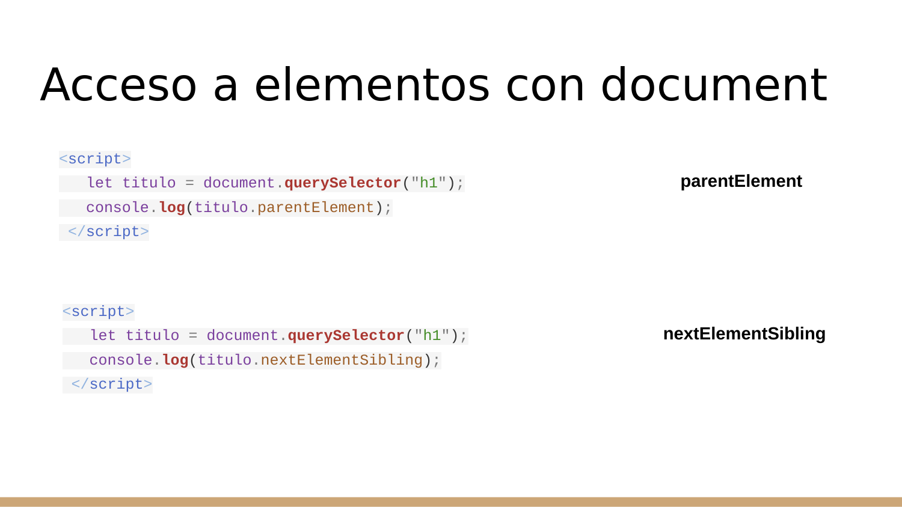

### Texto extraido

- Acceso a elementos con document
- 
- parentElement
- 
- nextElementSibling

## Slide 24

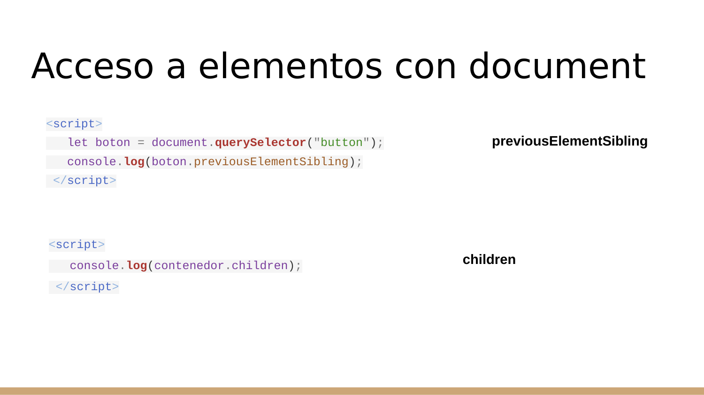

### Texto extraido

- Acceso a elementos con document
- 
- previousElementSibling
- 
- children

## Slide 25

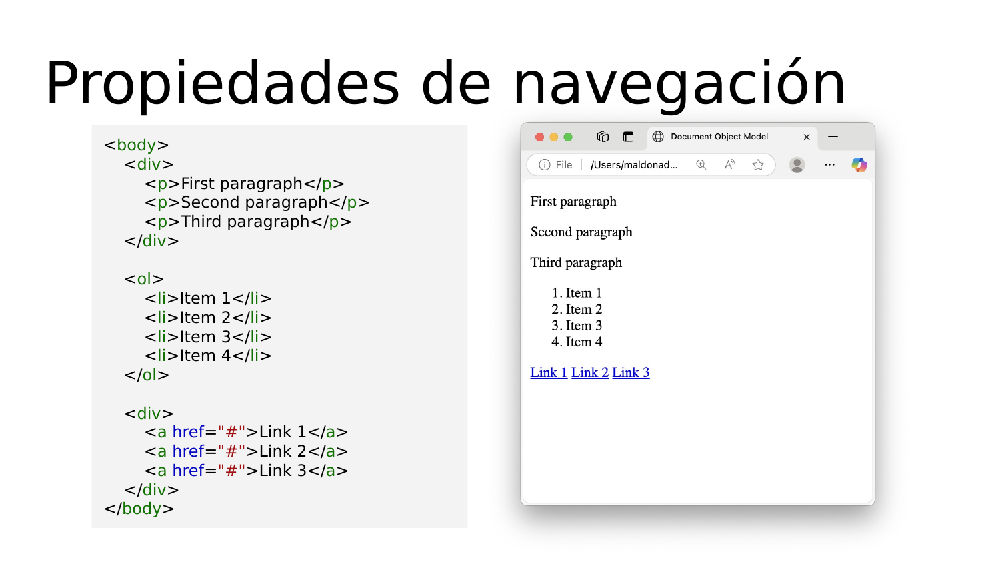

### Texto extraido

- Propiedades de navegación
- <body>
- 

- 
First paragraph

- 
Second paragraph

- 
Third paragraph

- 

- <ol>
- <li>Item 1</li>
- <li>Item 2</li>
- <li>Item 3</li>
- <li>Item 4</li>
- </ol>
- 

- <a href="#">Link 1</a>
- <a href="#">Link 2</a>
- <a href="#">Link 3</a>
- 

- </body>

### Imagenes incrustadas extraidas

- [slide_025_image_01.png](S13_s13_-Introduccion_al_DOM_assets/slide_025_image_01.png)

### Animaciones/transiciones

El PPTX contiene informacion de timing/animacion en este slide. Markdown no puede reproducirla; se conserva el estado visual estatico en la imagen renderizada.

## Slide 26

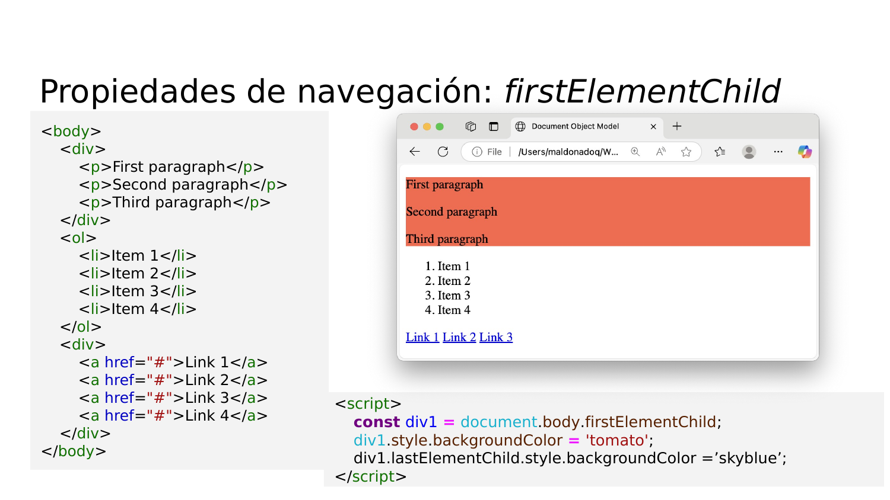

### Texto extraido

- Propiedades de navegación: firstElementChild
- <body>
- 

- 
First paragraph

- 
Second paragraph

- 
Third paragraph

- 

- <ol>
- <li>Item 1</li>
- <li>Item 2</li>
- <li>Item 3</li>
- <li>Item 4</li>
- </ol>
- 

- <a href="#">Link 1</a>
- <a href="#">Link 2</a>
- <a href="#">Link 3</a>
- <a href="#">Link 4</a>
- 

- </body>
- 

### Imagenes incrustadas extraidas

- [slide_026_image_01.png](S13_s13_-Introduccion_al_DOM_assets/slide_026_image_01.png)

### Animaciones/transiciones

El PPTX contiene informacion de timing/animacion en este slide. Markdown no puede reproducirla; se conserva el estado visual estatico en la imagen renderizada.

## Slide 27

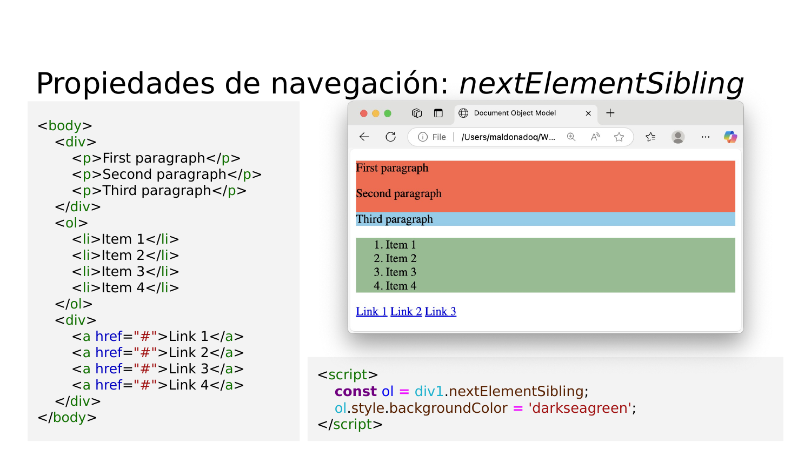

### Texto extraido

- 
- Propiedades de navegación: nextElementSibling
- <body>
- 

- 
First paragraph

- 
Second paragraph

- 
Third paragraph

- 

- <ol>
- <li>Item 1</li>
- <li>Item 2</li>
- <li>Item 3</li>
- <li>Item 4</li>
- </ol>
- 

- <a href="#">Link 1</a>
- <a href="#">Link 2</a>
- <a href="#">Link 3</a>
- <a href="#">Link 4</a>
- 

- </body>

### Imagenes incrustadas extraidas

- [slide_027_image_01.png](S13_s13_-Introduccion_al_DOM_assets/slide_027_image_01.png)

### Animaciones/transiciones

El PPTX contiene informacion de timing/animacion en este slide. Markdown no puede reproducirla; se conserva el estado visual estatico en la imagen renderizada.

## Slide 28

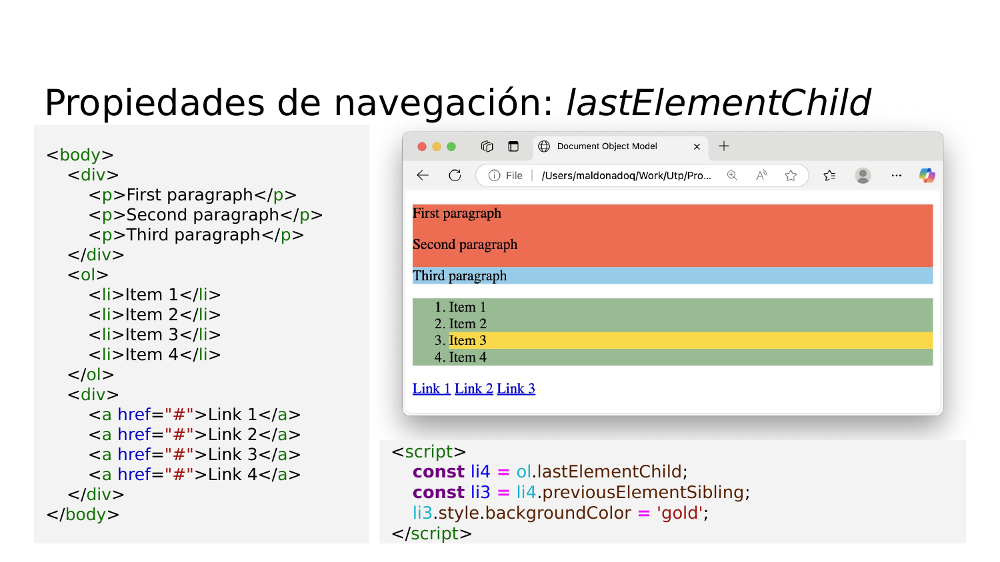

### Texto extraido

- 
- Propiedades de navegación: lastElementChild
- <body>
- 

- 
First paragraph

- 
Second paragraph

- 
Third paragraph

- 

- <ol>
- <li>Item 1</li>
- <li>Item 2</li>
- <li>Item 3</li>
- <li>Item 4</li>
- </ol>
- 

- <a href="#">Link 1</a>
- <a href="#">Link 2</a>
- <a href="#">Link 3</a>
- <a href="#">Link 4</a>
- 

- </body>

### Imagenes incrustadas extraidas

- [slide_028_image_01.png](S13_s13_-Introduccion_al_DOM_assets/slide_028_image_01.png)

## Slide 29

### Texto extraido

- Preguntas

### Imagenes incrustadas extraidas

- [slide_029_image_01.png](S13_s13_-Introduccion_al_DOM_assets/slide_029_image_01.png)

## Slide 30

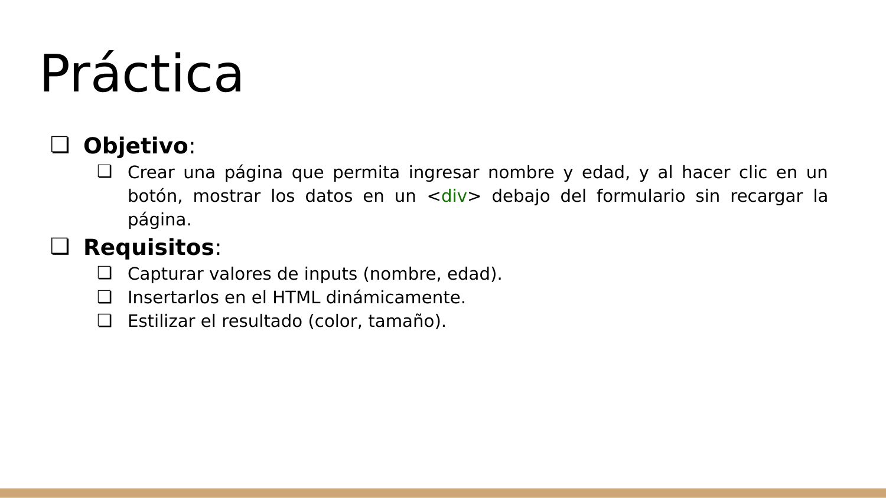

### Texto extraido

- Objetivo:
- Crear una página que permita ingresar nombre y edad, y al hacer clic en un botón, mostrar los datos en un 
 debajo del formulario sin recargar la página.
- Requisitos:
- Capturar valores de inputs (nombre, edad).
- Insertarlos en el HTML dinámicamente.
- Estilizar el resultado (color, tamaño).
- Práctica

## Slide 31

### Texto extraido

- Resumen de la sesión
- ¿Qué hemos aprendido hoy?
- Javascript
- ¿Para qué sirve Javascript?

### Animaciones/transiciones

El PPTX contiene informacion de timing/animacion en este slide. Markdown no puede reproducirla; se conserva el estado visual estatico en la imagen renderizada.

## Slide 32

### Texto extraido

- ¡Gracias!

## Slide 33

### Texto extraido

- TALLER DE PROGRAMACIÓN WEB
- M.Sc. Jesamin Zevallos Quispe
- c29741@utp.edu.pe

### Imagenes incrustadas extraidas

- [slide_033_image_01.png](S13_s13_-Introduccion_al_DOM_assets/slide_033_image_01.png)
