# S14_s14 - Menu responsivo y ventanas flotantes

- Fuente original: `S14_s14 - Menu responsivo y ventanas flotantes.pptx`
- Archivo Markdown: `S14_s14_-Menu_responsivo_y_ventanas_flotantes.md`
- Metodo: texto extraido desde el XML del PPTX y captura completa de cada slide renderizada con LibreOffice.
- Criterio de fidelidad: los elementos no textuales, como imagenes, formas, graficos, tablas dibujadas e iconos, quedan conservados en la imagen completa del slide.

## Slide 1

### Texto extraido

- TALLER DE PROGRAMACIÓN WEB
- M.Sc. Jesamin Zevallos Quispe
- c29741@utp.edu.pe

### Imagenes incrustadas extraidas

- [slide_001_image_01.png](S14_s14_-Menu_responsivo_y_ventanas_flotantes_assets/slide_001_image_01.png)

## Slide 2

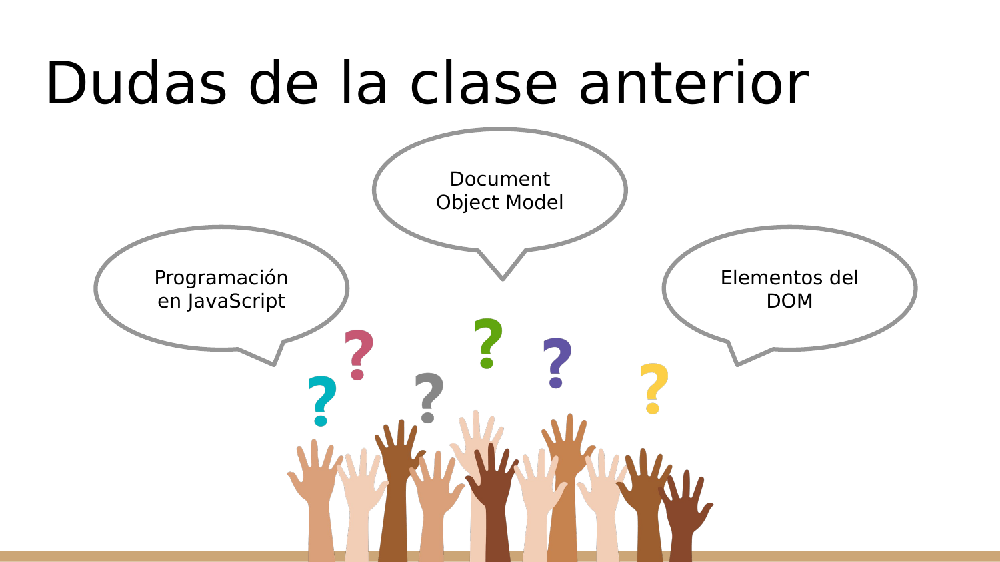

### Texto extraido

- Dudas de la clase anterior
- Programación en JavaScript
- Document Object Model
- Elementos del DOM

### Imagenes incrustadas extraidas

- [slide_002_image_01.png](S14_s14_-Menu_responsivo_y_ventanas_flotantes_assets/slide_002_image_01.png)

### Animaciones/transiciones

El PPTX contiene informacion de timing/animacion en este slide. Markdown no puede reproducirla; se conserva el estado visual estatico en la imagen renderizada.

## Slide 3

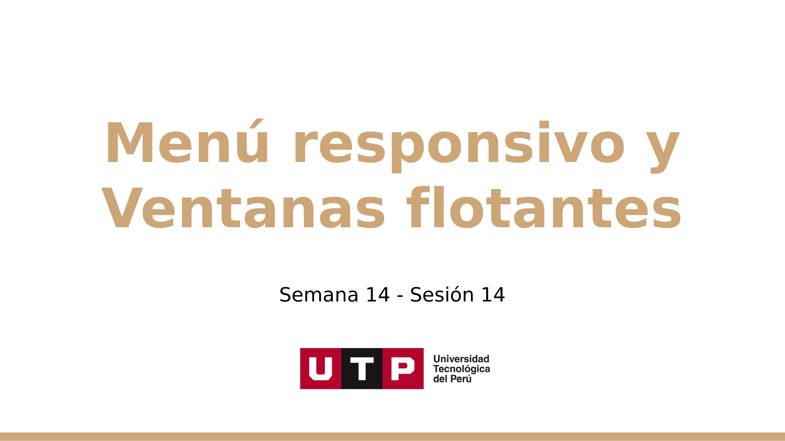

### Texto extraido

- Menú responsivo y Ventanas flotantes
- Semana 14 - Sesión 14

### Imagenes incrustadas extraidas

- [slide_003_image_01.png](S14_s14_-Menu_responsivo_y_ventanas_flotantes_assets/slide_003_image_01.png)

## Slide 4

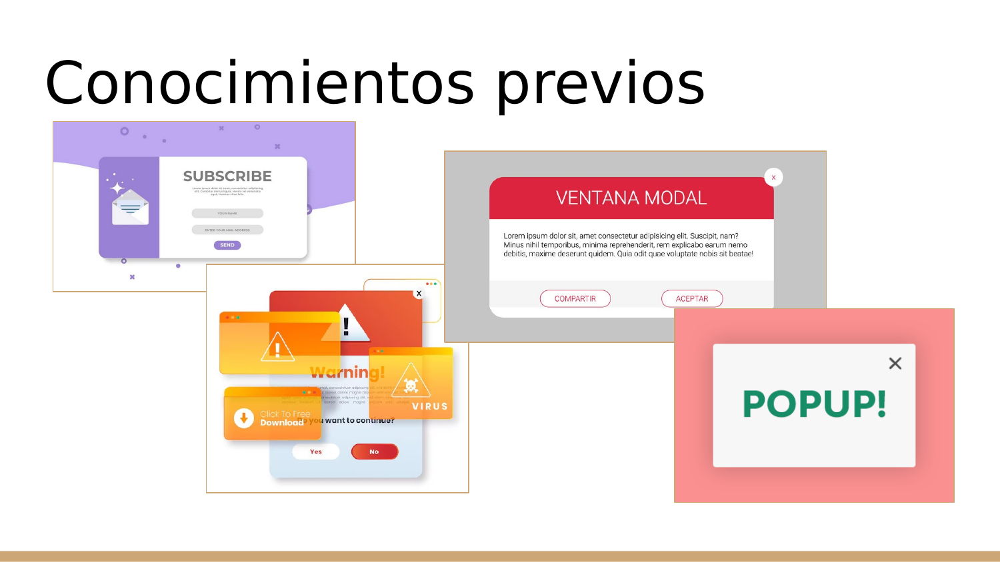

### Texto extraido

- Conocimientos previos

### Imagenes incrustadas extraidas

- [slide_004_image_01.png](S14_s14_-Menu_responsivo_y_ventanas_flotantes_assets/slide_004_image_01.png)
- [slide_004_image_02.png](S14_s14_-Menu_responsivo_y_ventanas_flotantes_assets/slide_004_image_02.png)
- [slide_004_image_03.png](S14_s14_-Menu_responsivo_y_ventanas_flotantes_assets/slide_004_image_03.png)
- [slide_004_image_04.png](S14_s14_-Menu_responsivo_y_ventanas_flotantes_assets/slide_004_image_04.png)

### Animaciones/transiciones

El PPTX contiene informacion de timing/animacion en este slide. Markdown no puede reproducirla; se conserva el estado visual estatico en la imagen renderizada.

## Slide 5

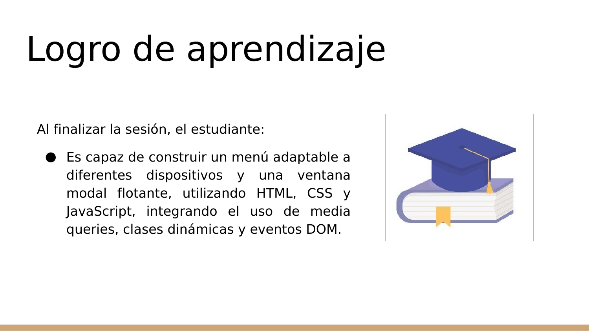

### Texto extraido

- Al finalizar la sesión, el estudiante:
- Es capaz de construir un menú adaptable a diferentes dispositivos y una ventana modal flotante, utilizando HTML, CSS y JavaScript, integrando el uso de media queries, clases dinámicas y eventos DOM.
- Logro de aprendizaje

### Imagenes incrustadas extraidas

- [slide_005_image_01.jpg](S14_s14_-Menu_responsivo_y_ventanas_flotantes_assets/slide_005_image_01.jpg)

## Slide 6

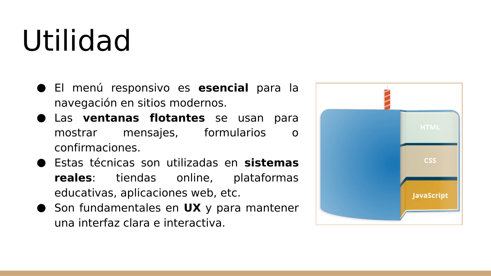

### Texto extraido

- El menú responsivo es esencial para la navegación en sitios modernos.
- Las ventanas flotantes se usan para mostrar mensajes, formularios o confirmaciones.
- Estas técnicas son utilizadas en sistemas reales: tiendas online, plataformas educativas, aplicaciones web, etc.
- Son fundamentales en UX y para mantener una interfaz clara e interactiva.
- Utilidad

### Imagenes incrustadas extraidas

- [slide_006_image_01.png](S14_s14_-Menu_responsivo_y_ventanas_flotantes_assets/slide_006_image_01.png)

## Slide 7

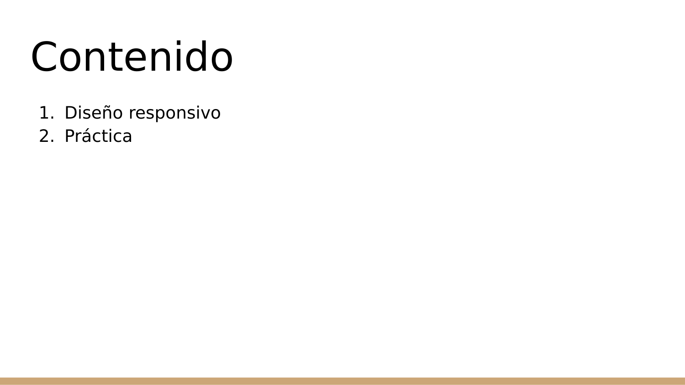

### Texto extraido

- Contenido
- Diseño responsivo
- Práctica

## Slide 8

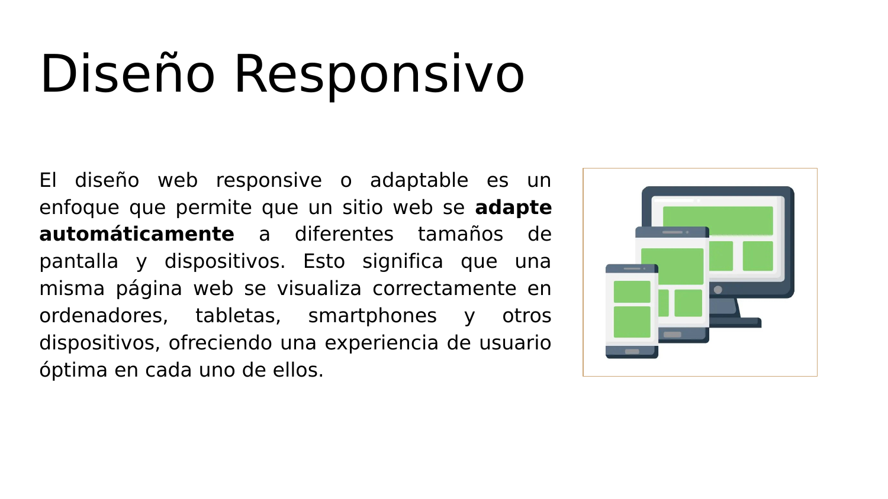

### Texto extraido

- El diseño web responsive o adaptable es un enfoque que permite que un sitio web se adapte automáticamente a diferentes tamaños de pantalla y dispositivos. Esto significa que una misma página web se visualiza correctamente en ordenadores, tabletas, smartphones y otros dispositivos, ofreciendo una experiencia de usuario óptima en cada uno de ellos.
- Diseño Responsivo

### Imagenes incrustadas extraidas

- [slide_008_image_01.png](S14_s14_-Menu_responsivo_y_ventanas_flotantes_assets/slide_008_image_01.png)

## Slide 9

### Texto extraido

- Diseño Responsivo
- Características
- Cada vez más usuarios navegan en móvil.
- Mejora la experiencia de usuario.
- Es fundamental para el SEO.
- Mejorarás la confianza en tu marca.

### Imagenes incrustadas extraidas

- [slide_009_image_01.png](S14_s14_-Menu_responsivo_y_ventanas_flotantes_assets/slide_009_image_01.png)

## Slide 10

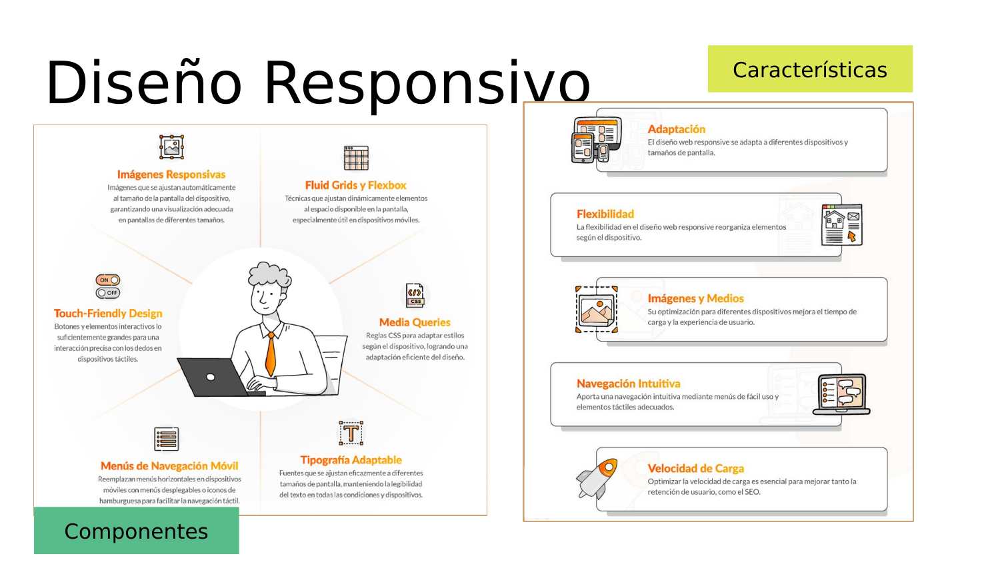

### Texto extraido

- Diseño Responsivo
- Características
- Componentes

### Imagenes incrustadas extraidas

- [slide_010_image_01.png](S14_s14_-Menu_responsivo_y_ventanas_flotantes_assets/slide_010_image_01.png)
- [slide_010_image_02.png](S14_s14_-Menu_responsivo_y_ventanas_flotantes_assets/slide_010_image_02.png)

### Animaciones/transiciones

El PPTX contiene informacion de timing/animacion en este slide. Markdown no puede reproducirla; se conserva el estado visual estatico en la imagen renderizada.

## Slide 11

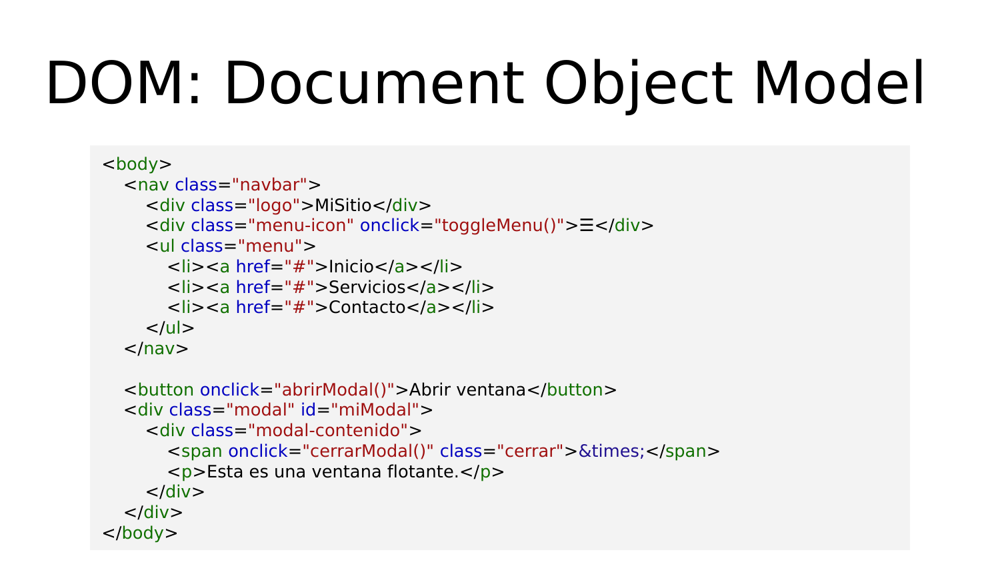

### Texto extraido

- DOM: Document Object Model
- <body>
- <nav class="navbar">
- 
MiSitio

- 
☰

- <ul class="menu">
- <li><a href="#">Inicio</a></li>
- <li><a href="#">Servicios</a></li>
- <li><a href="#">Contacto</a></li>
- </ul>
- </nav>
- <button onclick="abrirModal()">Abrir ventana</button>
- 

- 

- &times;
- 
Esta es una ventana flotante.

- 

- </body>

## Slide 12

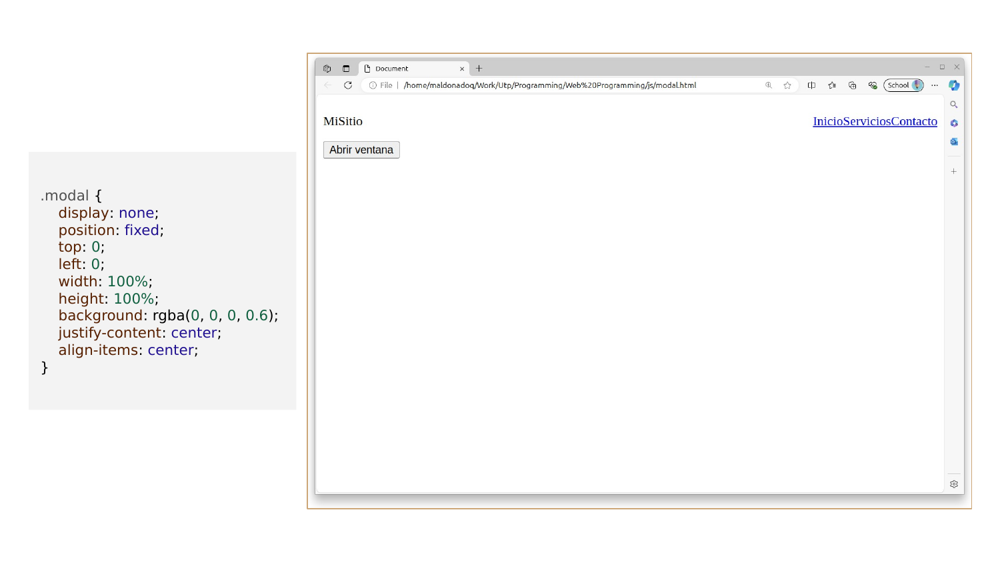

### Texto extraido

- .modal {
- display: none;
- position: fixed;
- top: 0;
- left: 0;
- width: 100%;
- height: 100%;
- background: rgba(0, 0, 0, 0.6);
- justify-content: center;
- align-items: center;
- }

### Imagenes incrustadas extraidas

- [slide_012_image_01.png](S14_s14_-Menu_responsivo_y_ventanas_flotantes_assets/slide_012_image_01.png)

## Slide 13

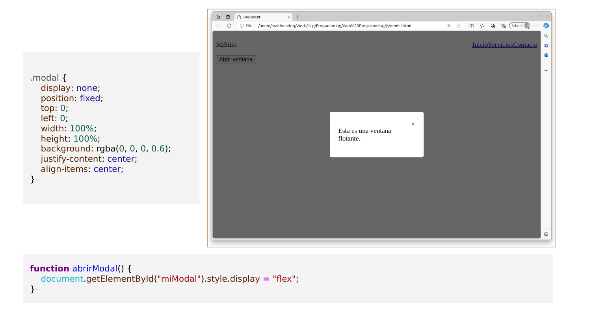

### Texto extraido

- .modal {
- display: none;
- position: fixed;
- top: 0;
- left: 0;
- width: 100%;
- height: 100%;
- background: rgba(0, 0, 0, 0.6);
- justify-content: center;
- align-items: center;
- }
- function abrirModal() {
- document.getElementById("miModal").style.display = "flex";
- }

### Imagenes incrustadas extraidas

- [slide_013_image_01.png](S14_s14_-Menu_responsivo_y_ventanas_flotantes_assets/slide_013_image_01.png)

## Slide 14

### Texto extraido

- Diseño Responsivo - Ejemplo
- https://github.com/maldonadoq/programming/blob/utp/Web%20Programming/js/signin.html

## Slide 15

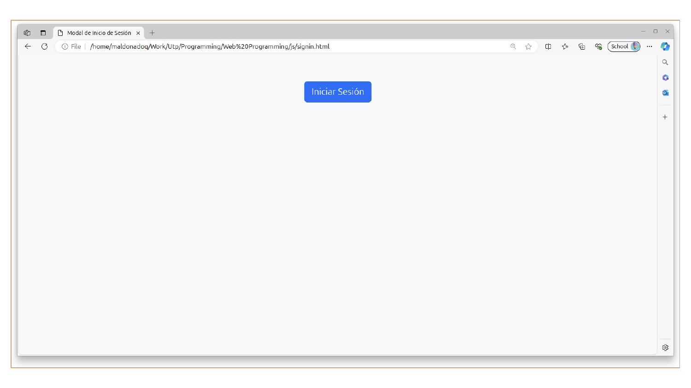

### Texto extraido

No se detecto texto editable en el XML del slide. Revisar la imagen completa del slide para el contenido visual.

### Imagenes incrustadas extraidas

- [slide_015_image_01.png](S14_s14_-Menu_responsivo_y_ventanas_flotantes_assets/slide_015_image_01.png)

## Slide 16

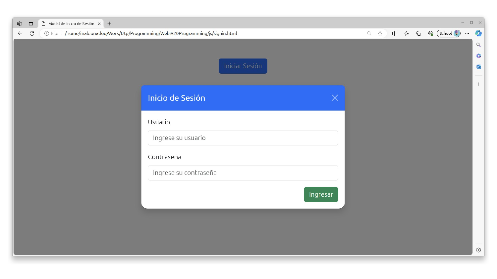

### Texto extraido

No se detecto texto editable en el XML del slide. Revisar la imagen completa del slide para el contenido visual.

### Imagenes incrustadas extraidas

- [slide_016_image_01.png](S14_s14_-Menu_responsivo_y_ventanas_flotantes_assets/slide_016_image_01.png)

## Slide 17

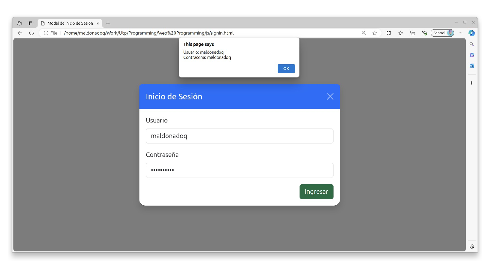

### Texto extraido

No se detecto texto editable en el XML del slide. Revisar la imagen completa del slide para el contenido visual.

### Imagenes incrustadas extraidas

- [slide_017_image_01.png](S14_s14_-Menu_responsivo_y_ventanas_flotantes_assets/slide_017_image_01.png)

## Slide 18

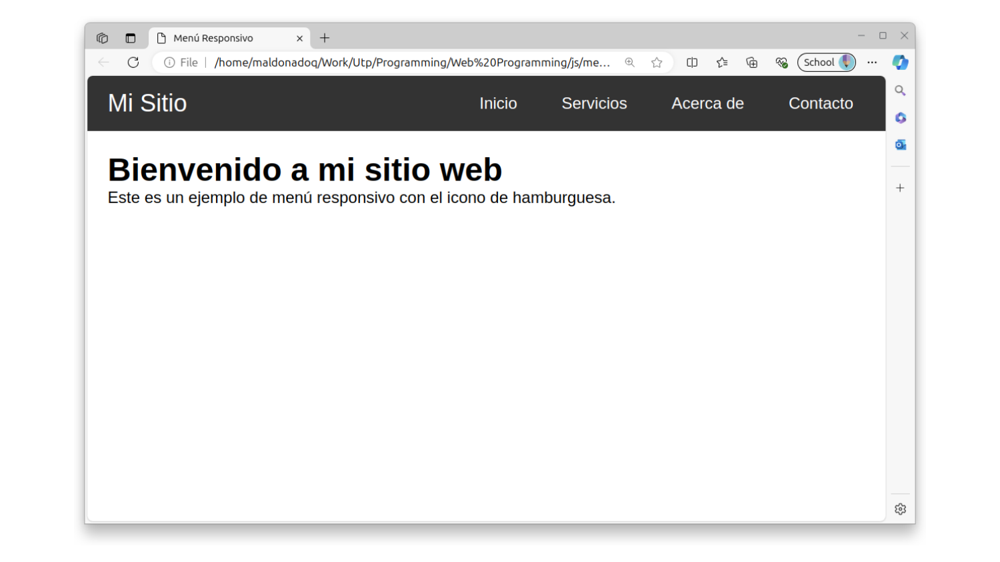

### Texto extraido

No se detecto texto editable en el XML del slide. Revisar la imagen completa del slide para el contenido visual.

### Imagenes incrustadas extraidas

- [slide_018_image_01.png](S14_s14_-Menu_responsivo_y_ventanas_flotantes_assets/slide_018_image_01.png)

## Slide 19

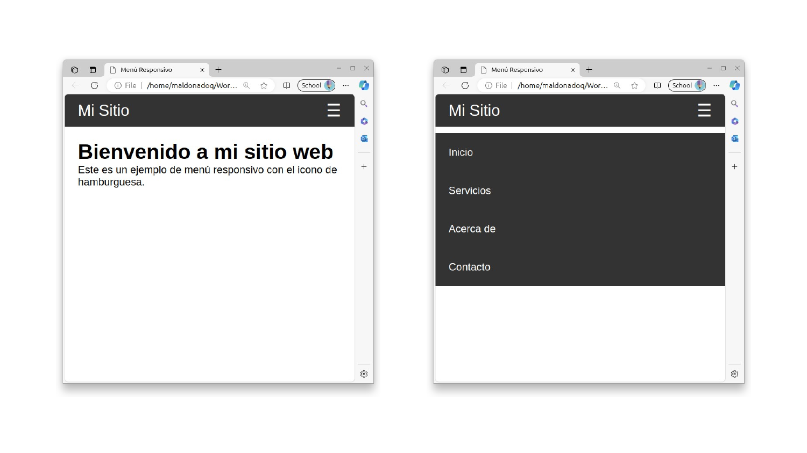

### Texto extraido

No se detecto texto editable en el XML del slide. Revisar la imagen completa del slide para el contenido visual.

### Imagenes incrustadas extraidas

- [slide_019_image_01.png](S14_s14_-Menu_responsivo_y_ventanas_flotantes_assets/slide_019_image_01.png)
- [slide_019_image_02.png](S14_s14_-Menu_responsivo_y_ventanas_flotantes_assets/slide_019_image_02.png)

### Animaciones/transiciones

El PPTX contiene informacion de timing/animacion en este slide. Markdown no puede reproducirla; se conserva el estado visual estatico en la imagen renderizada.

## Slide 20

### Texto extraido

- Preguntas

### Imagenes incrustadas extraidas

- [slide_020_image_01.png](S14_s14_-Menu_responsivo_y_ventanas_flotantes_assets/slide_020_image_01.png)

## Slide 21

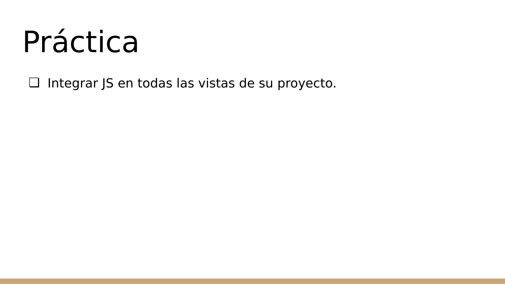

### Texto extraido

- Integrar JS en todas las vistas de su proyecto.
- Práctica

## Slide 22

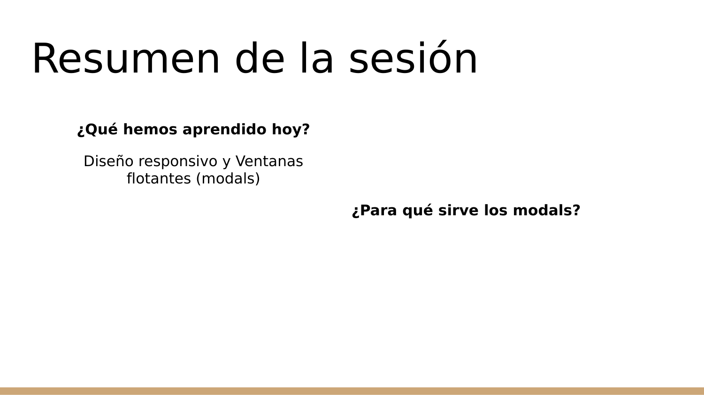

### Texto extraido

- Resumen de la sesión
- ¿Qué hemos aprendido hoy?
- Diseño responsivo y Ventanas flotantes (modals)
- ¿Para qué sirve los modals?

### Animaciones/transiciones

El PPTX contiene informacion de timing/animacion en este slide. Markdown no puede reproducirla; se conserva el estado visual estatico en la imagen renderizada.

## Slide 23

### Texto extraido

- ¡Gracias!

## Slide 24

### Texto extraido

- TALLER DE PROGRAMACIÓN WEB
- M.Sc. Jesamin Zevallos Quispe
- c29741@utp.edu.pe

### Imagenes incrustadas extraidas

- [slide_024_image_01.png](S14_s14_-Menu_responsivo_y_ventanas_flotantes_assets/slide_024_image_01.png)
