# APF3 - 2026 | ChapaTuPromo

[FIGURA PORTADA: Logo UTP]

## AVANCE DE PROYECTO FINAL 3

# "ChapaTuPromo"

| Campo                     | Valor                            |
|---------------------------|----------------------------------|
| **CURSO:**                | Taller de Programacion Web       |
| **SECCIÓN:**              | 21003                            |
| **DOCENTE:**              | Jesamin Melissa Zevallos Quispe  |
| **ESTUDIANTE:**           | Max Benites Corazón              |
| **CÓDIGO:**               | U24217839                        |
| **PORCENTAJE DE AVANCE:** | 100%                             |
| **CICLO:**                | V                                |

Lima, 02 de Julio del 2026

*Universidad Tecnológica del Perú | Taller de Programación Web | Sección 21003*

---

## 1. DESCRIPCIÓN DEL PROYECTO

ChapaTuPromo es una plataforma web orientada a la reducción del desperdicio de alimentos. Permite que tiendas oferten productos próximos a vencer a precios accesibles. A diferencia de las unidades anteriores que se centraron exclusivamente en estructura (HTML) y diseño visual (CSS), este tercer avance (APF3) incorpora toda la lógica dinámica de interacción mediante **JavaScript (Vanilla)** en el Frontend y se conecta a una **Base de Datos Relacional (PostgreSQL)** mediante un servidor Backend construido con **Node.js**.

Ahora, el catálogo de productos es dinámico, los usuarios pueden registrarse y ser validados, las ofertas calculan sus descuentos automáticamente según la fecha de vencimiento, y los pedidos descuentan el stock disponible directamente en la base de datos de manera transaccional.

## 2. OBJETIVO DEL PROYECTO

Integrar comportamiento dinámico, manipulación del DOM y validaciones robustas en las 7 páginas obligatorias utilizando JavaScript, y persistir la información del negocio evidenciando la conexión exitosa a una Base de Datos relacional mediante consultas SQL (`SELECT`, `INSERT`, `UPDATE`), cumpliendo con los estándares indicados en rúbrica y las orientaciones de clase.

## 3. FUNCIONALIDADES IMPLEMENTADAS

- **Autenticación e Ingreso:** Validación de formato de correo y comprobación de existencia del usuario en PostgreSQL.
- **Registro de Usuarios:** Validación de campos mediante expresiones regulares (Regex) para nombres (solo alfabéticos), correos válidos, celulares (empieza con 9 y de 9 dígitos) y longitud de contraseña, antes de enviarlos a la base de datos.
- **Catálogo Dinámico:** Lectura de productos disponibles desde la base de datos para mostrarlos dinámicamente inyectando HTML desde JavaScript.
- **Carrito de Compras (Local):** Gestión del estado de productos seleccionados utilizando `localStorage`, impidiendo agregar más productos si se supera el stock máximo real.
- **Procesamiento de Pedidos:** Envío de la data del cliente y carrito hacia el backend, generando el registro del pedido, su detalle y, mediante un `UPDATE` en SQL, descontando el stock del producto en la tienda.
- **Ofertas Calculadas:** El backend calcula los días faltantes para el vencimiento y aplica un porcentaje de descuento dinámico (50%, 40%, 30%), enviando dicha métrica al frontend para resaltar visualmente su urgencia.
- **Manipulación de Temas:** Cambio de tema (modo claro / modo oscuro) detectando el evento `change` del select y guardando la preferencia localmente.

## 4. ESTRUCTURA DE PÁGINAS Y SCRIPTS

| Página / Vista HTML              | Script Asociado JS               | Funcionalidad Principal JS |
|----------------------------------|----------------------------------|----------------------------|
| **index.html**                   | `index.js`, `config.js`          | Cambio de tema visual dinámico, carga de resumen numérico (productos y ofertas disponibles). |
| **login_chapatupromo.html**      | `login.js`, `config.js`          | Validación de campos vacíos y petición HTTP `POST` al backend para autorizar ingreso. |
| **registrar_chapatupromo.html**  | `registrar.js`, `config.js`      | Prevención de envío (preventDefault), uso de expresiones regulares (Regex) y alertas de errores (DOM y alerts). |
| **menu_chapatupromo.html**       | `menu.js`, `config.js`           | Petición HTTP `GET`, renderizado dinámico de la tabla (`innerHTML`) y manejo de stock en `localStorage`. |
| **formulario_chapatupromo.html** | `formulario.js`, `config.js`     | Lectura del carrito, cálculo de sumatoria de totales y petición HTTP `POST` para procesar el pedido. |
| **pedidos_chapatupromo.html**    | `pedidos.js`, `config.js`        | Recepción de arreglos del historial de pedidos agrupados para pintar la tabla principal de administración. |
| **ofertas_chapatupromo.html**    | `ofertas.js`, `config.js`        | Filtro del arreglo JSON recibido usando `.filter()` para agrupar productos según cercanía a su fecha de caducidad. |

## 5. TECNOLOGÍAS UTILIZADAS

### Frontend
- **HTML5 y CSS3 puro** (Estructura y diseño responsivo heredado del APF2).
- **JavaScript (Vanilla):** Funciones flecha, destructuración, promesas (`fetch`, `Promise.all`), manipulación de arreglos (`map`, `filter`, `reduce`), manejo de eventos y modificación en tiempo real del DOM.

### Backend y Almacenamiento
- **Node.js con Express:** Servidor intermediario que levanta en el puerto 3000 y provee los servicios web (API).
- **PostgreSQL (vía librería `pg`):** Base de datos relacional para guardar `usuarios`, `productos`, `pedidos` y `detalle_pedido`.

---

## 6. CAPTURAS DEL RESULTADO VISUAL

*(Las siguientes capturas muestran las 7 páginas funcionando en el navegador).*

### 6.1 Página de Inicio (index.html)
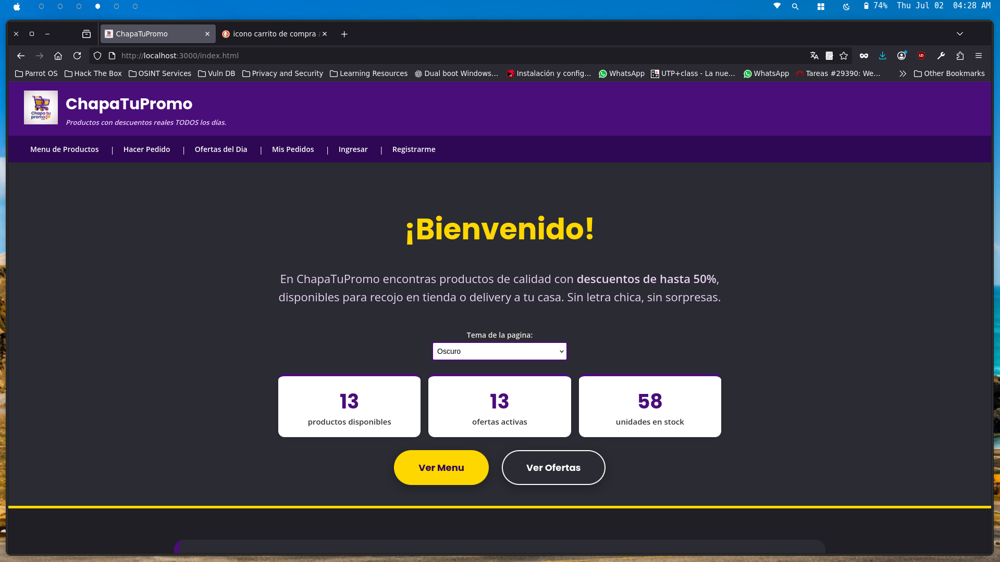
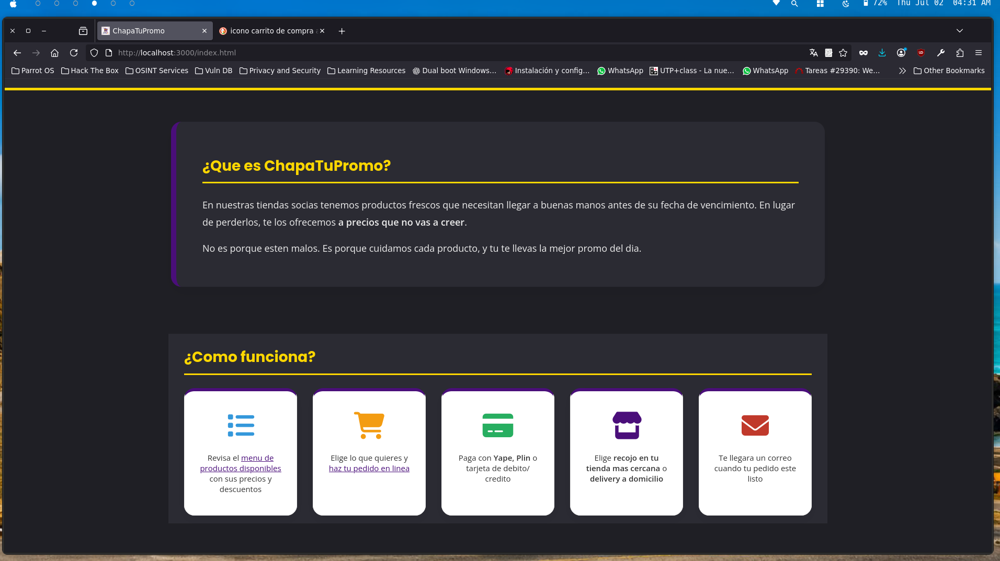
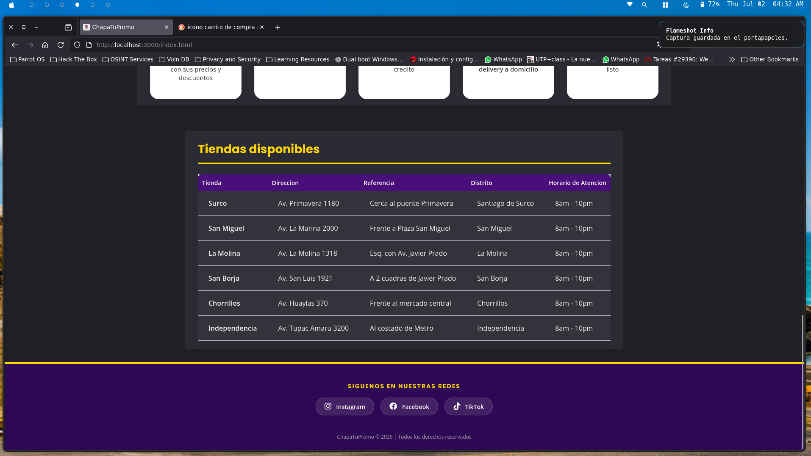

### 6.2 Login (login_chapatupromo.html)
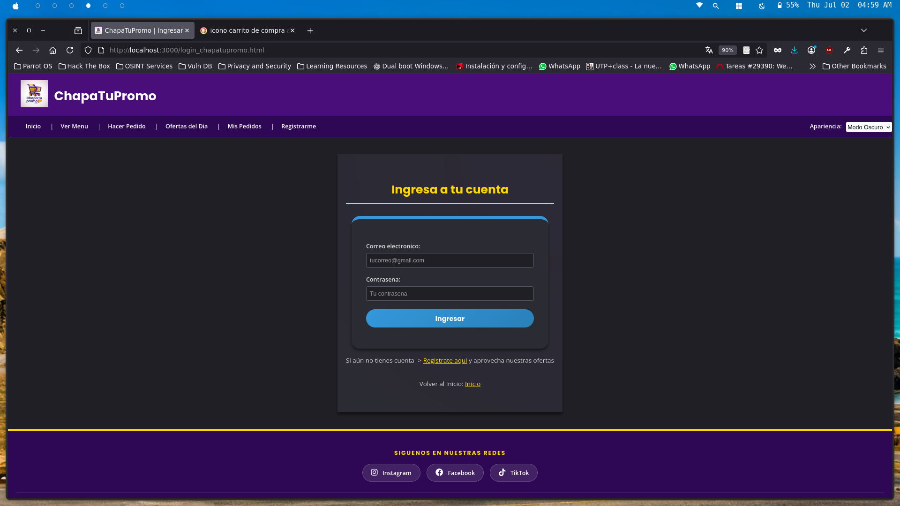

### 6.3 Registro de Usuario (registrar_chapatupromo.html)
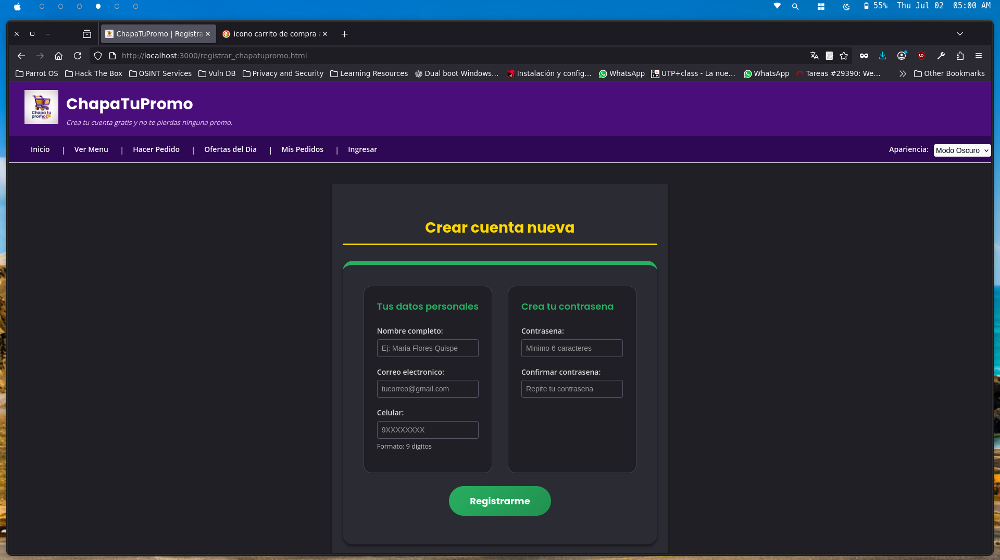

### 6.4 Menú de Productos (menu_chapatupromo.html)
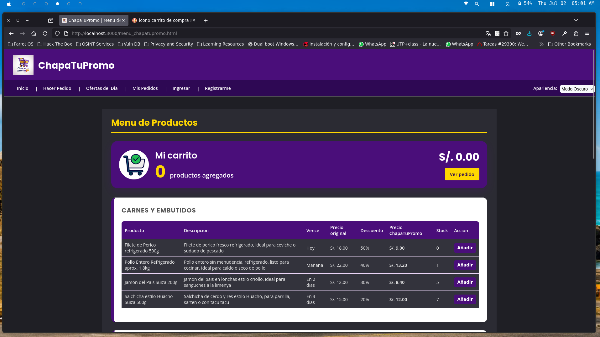
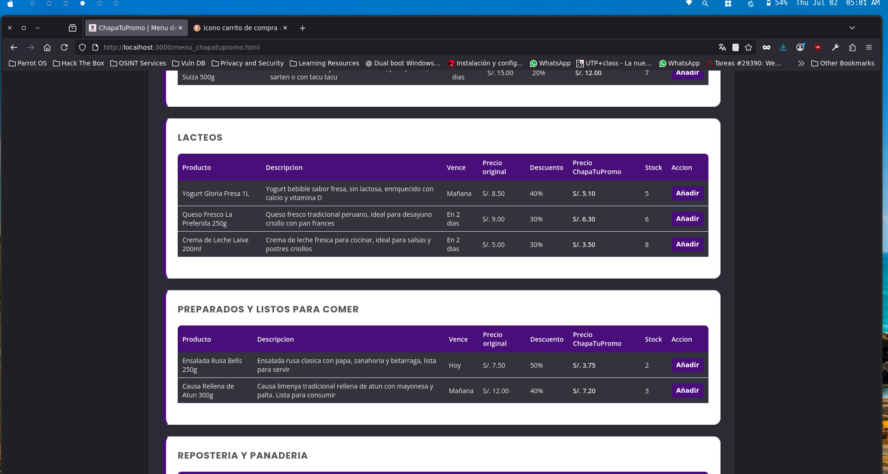
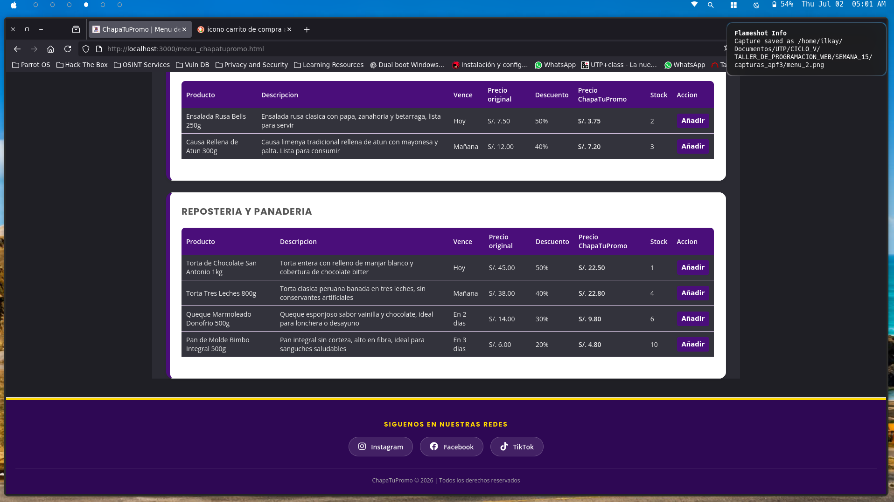
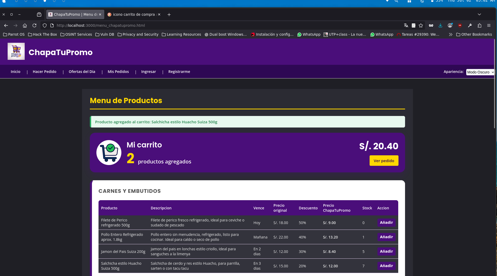

### 6.5 Formulario de Pedido (formulario_chapatupromo.html)
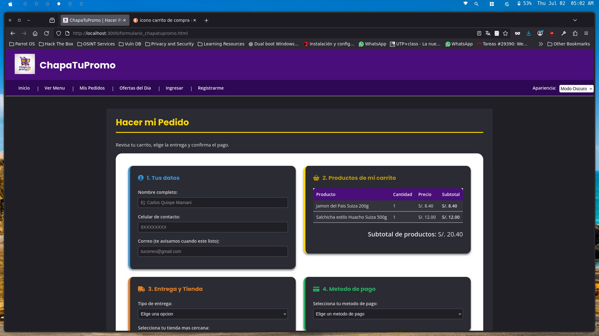
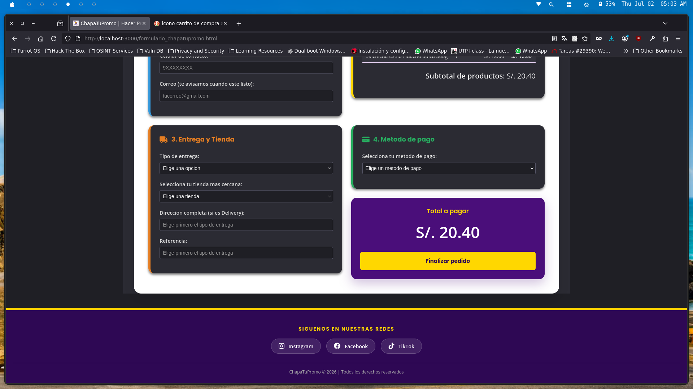

### 6.6 Tabla de Pedidos (pedidos_chapatupromo.html)
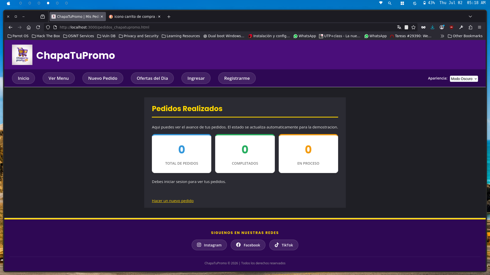

### 6.7 Ofertas (ofertas_chapatupromo.html)
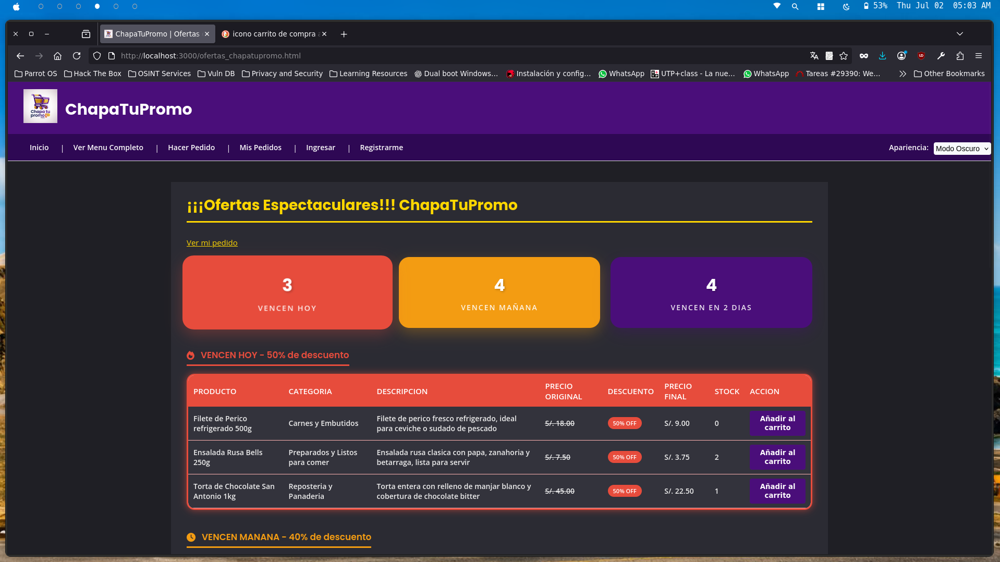
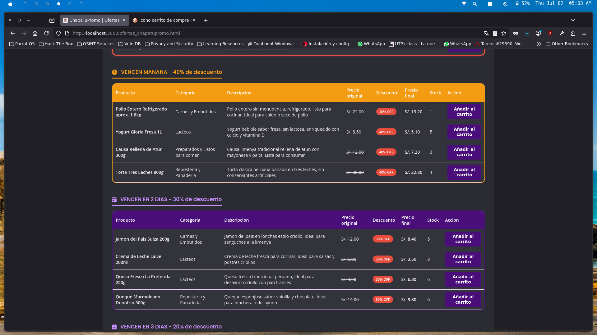
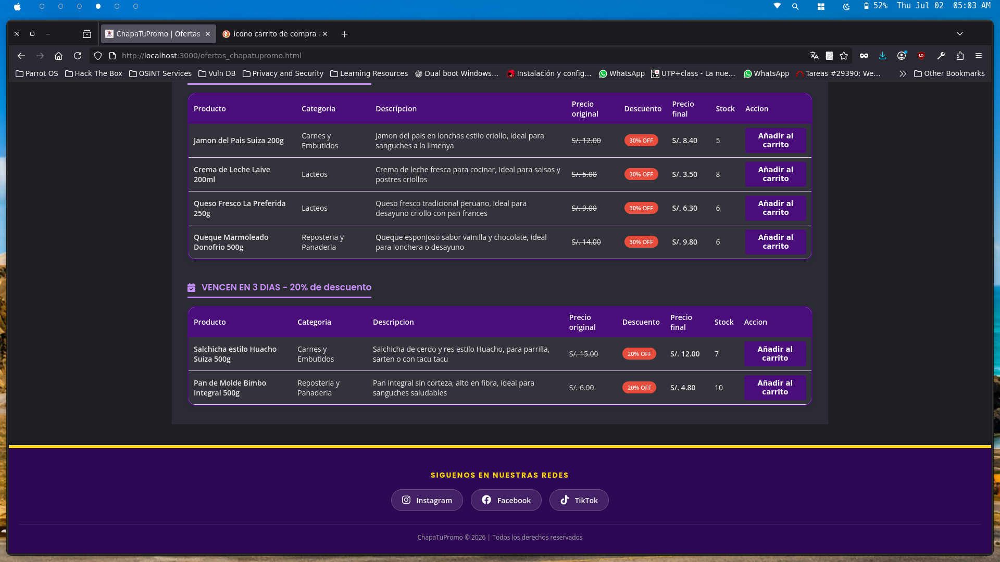

---

## 7. CAPTURAS DEL CÓDIGO JAVASCRIPT Y EXPLICACIÓN

*(Las siguientes capturas evidencian el código JS implementado y su objetivo por cada vista).*

### 7.1 Lógica de Registro (registrar.js)
**Explicación:** Se utiliza el evento `submit` del formulario. Antes de enviar los datos, se capturan las variables y se validan con expresiones regulares (Regex) para asegurar que el nombre no contenga números, el formato de correo sea válido y el celular inicie con 9. Se usan condicionales (`if`) para notificar errores alterando las clases CSS del DOM y lanzando `alert()`.
[CAPTURA_JS: registrar_js.png]

### 7.2 Lógica de Menú y Carrito (menu.js)
**Explicación:** Se realiza una petición (`fetch`) a la API del backend. Se recibe el arreglo JSON de productos y, mediante arreglos y un bucle `forEach`, se inyectan dinámicamente las etiquetas HTML (con `.innerHTML`) construyendo las tablas. También se manipula `localStorage` para añadir al carrito y calcular que la compra no exceda el límite del stock.
[CAPTURA_JS: menu_js.png]

### 7.3 Lógica de Interacción en Inicio (index.js)
**Explicación:** Se ejecuta `Promise.all` para lanzar 2 peticiones paralelas al backend (productos y ofertas) y luego utilizar la función `.reduce()` para sumar el stock total global. Además, escucha el evento `change` en la lista desplegable de temas visuales para alternar la apariencia del sitio.
[CAPTURA_JS: index_js.png]

### 7.4 Lógica del Formulario de Compra (formulario.js)
**Explicación:** Lee la información persistente del carrito y renderiza los ítems seleccionados. Al confirmar la compra, encapsula el paquete JSON y lo envía vía método POST, aguardando que el backend informe del éxito para limpiar el carrito y redirigir al usuario.
[CAPTURA_JS: formulario_js.png]

### 7.5 Lógica de Ofertas (ofertas.js)
**Explicación:** Al obtener los productos, se utiliza `.filter()` para agrupar los arreglos en tres listas diferentes de urgencia (vencen hoy, mañana, o en 2 días), invocando múltiples renderizados de HTML dentro del DOM de la página para llenar cada sección promocional.
[CAPTURA_JS: ofertas_js.png]

### 7.6 Lógica de Pedidos Realizados (pedidos.js)
**Explicación:** Se encarga de conectarse al endpoint de lectura de pedidos (`GET /api/pedidos`). Lee las fechas, cliente y total generado. Luego itera en los registros para crear las filas dinámicamente y permitir (mediante un `<select>` generado al vuelo y un evento de cambio) actualizar el estado de cada pedido.
[CAPTURA_JS: pedidos_js.png]

### 7.7 Lógica de Login (login.js)
**Explicación:** Captura correo y password y los manda vía fetch POST al backend. Lee la respuesta JSON del servidor para validar si las credenciales son incorrectas o si debe dejar pasar al usuario alterando la ubicación de la ventana (redirección a menú).
[CAPTURA_JS: login_js.png]

---

## 8. CAPTURAS DE BASE DE DATOS Y BACKEND (NODE.JS)

*(Evidencia de la conexión, las tablas y las consultas obligatorias ejecutadas).*

### 8.1 Backend Ejecutándose y Consultas SELECT (Node.js)
**Explicación:** Captura de pantalla de la terminal mostrando el servidor Node.js ejecutándose (`node server.js`). Adicionalmente, el código donde se evidencia la ejecución de un `SELECT` (ej. al consultar todos los productos para el menú o para el login).
[CAPTURA_BD: backend_select.png]

### 8.2 Inserción de un Pedido (INSERT) y Actualización de Stock (UPDATE)
**Explicación:** Captura del código del backend (`server.js`) donde, de manera transaccional, ocurre el `INSERT INTO pedidos...` y seguidamente el `UPDATE productos SET stock = stock - 1...`.
[CAPTURA_BD: backend_insert_update.png]

### 8.3 Base de Datos PostgreSQL (PgAdmin / Consola)
**Explicación:** Captura de la base de datos (PostgreSQL, DBeaver, PgAdmin, etc.) donde se puede observar que los datos (usuarios, productos o pedidos) han sido guardados y alterados correctamente, evidenciando que el stock bajó tras una compra.
[CAPTURA_BD: base_de_datos.png]

---

## 9. LINK DEL REPOSITORIO

Repositorio en GitHub: **https://github.com/MaxBenitesC/Study-UTP-System** (Ubicado en CICLO_V / TALLER_DE_PROGRAMACION_WEB / SEMANA_15)

---

## 10. OBSERVACIONES Y CONCLUSIONES

El desarrollo correspondiente al Avance de Proyecto Final 3 consolida los requisitos técnicos solicitados:

1. **Uso integral de JavaScript:** En vez de insertar interactividad superficial, se incorporó una lógica completa de e-commerce mediante Vanilla JS. Se evidenciaron validaciones locales (Regex), manejo de objetos, eventos dinámicos (`change`, `submit`, `click`) y modificación activa del DOM (inyectando tablas desde JS).
2. **Conexión a BD e Intermediario:** Se implementó una arquitectura de dos capas con Node.js como puente, evitando conectar JS cliente de forma directa a la Base de Datos (práctica solicitada en el alcance técnico).
3. **Persistencia Relacional (PostgreSQL):** La base de datos no es de adorno. Toda la data del menú fluye desde un `SELECT`. Cada usuario se registra vía `INSERT`. El flujo de negocio más importante se completó: cuando un pedido se guarda, el stock del producto disminuye obligatoriamente mediante un `UPDATE` en la tabla maestra.

El proyecto es totalmente escalable y finaliza con éxito los módulos de HTML, CSS, Lógica Frontend con JS e Integración a Bases de Datos.

*Universidad Tecnológica del Perú | Taller de Programacion Web | Sección 21003*
