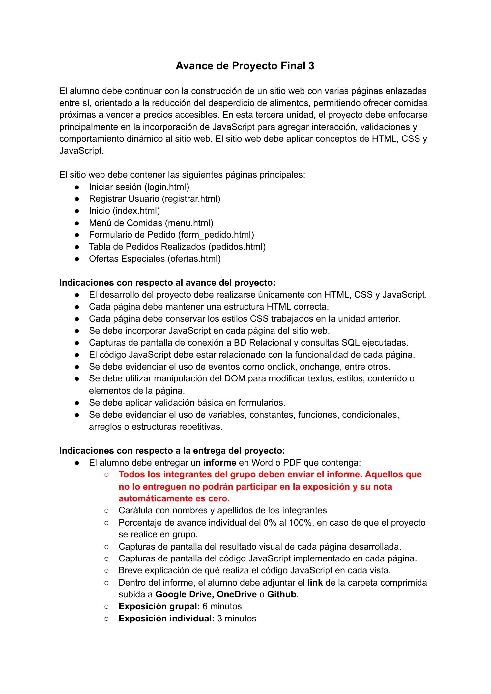

# Avance de Proyecto Final 3

El alumno debe continuar con la construcción de un sitio web con varias páginas enlazadas entre sí, orientado a la reducción del desperdicio de alimentos, permitiendo ofrecer comidas próximas a vencer a precios accesibles. En esta tercera unidad, el proyecto debe enfocarse principalmente en la incorporación de JavaScript para agregar interacción, validaciones y comportamiento dinámico al sitio web. El sitio web debe aplicar conceptos de HTML, CSS y JavaScript.

El sitio web debe contener las siguientes páginas principales:

- Iniciar sesión (`login.html`)
- Registrar Usuario (`registrar.html`)
- Inicio (`index.html`)
- Menú de Comidas (`menu.html`)
- Formulario de Pedido (`form_pedido.html`)
- Tabla de Pedidos Realizados (`pedidos.html`)
- Ofertas Especiales (`ofertas.html`)

## Indicaciones con respecto al avance del proyecto

- El desarrollo del proyecto debe realizarse únicamente con HTML, CSS y JavaScript.
- Cada página debe mantener una estructura HTML correcta.
- Cada página debe conservar los estilos CSS trabajados en la unidad anterior.
- Se debe incorporar JavaScript en cada página del sitio web.
- Capturas de pantalla de conexión a BD Relacional y consultas SQL ejecutadas.
- El código JavaScript debe estar relacionado con la funcionalidad de cada página.
- Se debe evidenciar el uso de eventos como `onclick`, `onchange`, entre otros.
- Se debe utilizar manipulación del DOM para modificar textos, estilos, contenido o elementos de la página.
- Se debe aplicar validación básica en formularios.
- Se debe evidenciar el uso de variables, constantes, funciones, condicionales, arreglos o estructuras repetitivas.

## Indicaciones con respecto a la entrega del proyecto

El alumno debe entregar un informe en Word o PDF que contenga:

- Todos los integrantes del grupo deben enviar el informe. Aquellos que no lo entreguen no podrán participar en la exposición y su nota automáticamente es cero.
- Carátula con nombres y apellidos de los integrantes.
- Porcentaje de avance individual del 0% al 100%, en caso de que el proyecto se realice en grupo.
- Capturas de pantalla del resultado visual de cada página desarrollada.
- Capturas de pantalla del código JavaScript implementado en cada página.
- Breve explicación de qué realiza el código JavaScript en cada vista.
- Dentro del informe, el alumno debe adjuntar el link de la carpeta comprimida subida a Google Drive, OneDrive o Github.
- Exposición grupal: 6 minutos.
- Exposición individual: 3 minutos.

## Apuntes de clase y video sobre APF3

Estos apuntes complementan la rubrica del PDF. Corresponden a indicaciones explicadas por la docente en clase/video.

### Alcance tecnico

- El foco principal de APF3 es JavaScript y conexion a base de datos relacional.
- La base de datos es obligatoria y debe ser relacional: PostgreSQL, MySQL, SQLite, SQL Server u otra similar.
- La conexion a la base de datos puede realizarse mediante Node.js u otro backend/intermediario.
- No es recomendable conectar JavaScript del navegador directamente con SQL; debe existir un intermediario.
- El proyecto debe seguir usando HTML, CSS y JavaScript.
- No usar Bootstrap ni frameworks.
- Las 7 paginas obligatorias deben mantenerse presentes.
- Se pueden agregar paginas adicionales si aportan al proyecto.
- Cada una de las 7 paginas obligatorias debe tener JavaScript relacionado con su funcionalidad.

### JavaScript esperado

- Incorporar JavaScript en todas las paginas principales.
- Evidenciar eventos como `onclick`, `onchange` u otros.
- Usar variables, constantes, funciones, condicionales, arreglos y/o estructuras repetitivas.
- Manipular el DOM para modificar texto, estilos, contenido, visibilidad o elementos.
- Usar validaciones basicas en formularios.
- Validar nombres con caracteres alfabeticos; no aceptar nombres numericos ni caracteres especiales.
- Validar formato de correo antes de enviar datos.
- Mostrar alertas o mensajes en pantalla cuando una validacion falle.
- No enviar informacion al backend si los datos del formulario son invalidos.
- Se puede usar `alert`, `prompt`, `console.log`, botones, selects y cambios visuales.
- Se puede implementar modo claro / modo oscuro.
- Se puede cambiar el fondo o estilos desde un `select`, como se trabajo en clase.
- El codigo JavaScript debe tener sentido con la pagina donde se encuentra.
- En los videos revisados no se menciono explicitamente `fetch`, JSON o API; su uso se justifica por la necesidad de conectar el frontend con el backend Node.js y la base de datos.
- La prioridad de la docente esta en evidenciar JavaScript: validaciones, eventos, DOM, estilos dinamicos y comportamiento sin recargar pagina.

### Base de datos y consultas esperadas

- Se debe evidenciar conexion a la base de datos relacional.
- Se deben mostrar capturas de consultas SQL ejecutadas o invocadas desde el backend/codigo.
- La base de datos no debe opacar el foco de JavaScript; debe cumplir como almacenamiento y evidencia de conexion.
- No es necesario implementar todo el CRUD completo.
- `DELETE` no es obligatorio.
- Consultas necesarias/recomendadas:
  - `SELECT` para listar productos.
  - `SELECT` para verificar si un usuario existe en la base de datos.
  - `INSERT` para crear un usuario.
  - `INSERT` para crear un pedido.
  - `UPDATE` para actualizar stock despues de una compra.
  - `UPDATE` para actualizar estado de pedido.
- Ejemplo explicado: si hay 5 productos en stock y el usuario compra 1, el stock debe actualizarse a 4.

### Flujo recomendado para ChapaTuPromo

- El menu debe listar productos desde la base de datos.
- La pagina de ofertas debe mostrar productos proximos a vencer.
- El carrito de compra puede ser temporal en JavaScript.
- El pedido solo debe crearse en la base de datos cuando el usuario confirma la compra o pago.
- No se debe permitir comprar si el carrito esta vacio.
- Al crear un pedido se debe registrar el detalle del pedido y actualizar el stock.
- La tabla de pedidos debe poder mostrar pedidos guardados en la base de datos.
- Se puede actualizar el estado del pedido, por ejemplo: `Pendiente`, `Preparando`, `Listo para recojo`, `Entregado`.

### Validaciones sugeridas por pagina

- `registrar_chapatupromo.html`:
  - Validar que el nombre tenga caracteres alfabeticos.
  - Validar correo.
  - Validar password y confirmacion.
  - Crear usuario en la base de datos.

- `login_chapatupromo.html`:
  - Validar campos vacios.
  - Verificar si el usuario existe en la base de datos.
  - Mostrar mensaje de ingreso correcto o error.

- `index.html`:
  - Agregar interaccion visual, por ejemplo modo claro / modo oscuro.
  - Mostrar contenido dinamico relacionado con el proyecto.

- `menu_chapatupromo.html`:
  - Listar productos desde la base de datos.
  - Mostrar precios, stock y descuentos.
  - Permitir agregar productos al carrito temporal.

- `formulario_chapatupromo.html`:
  - Validar datos del cliente.
  - Validar que haya productos seleccionados.
  - Calcular total.
  - Crear pedido solo al confirmar.

- `pedidos_chapatupromo.html`:
  - Listar pedidos desde la base de datos.
  - Permitir actualizar estado del pedido.

- `ofertas_chapatupromo.html`:
  - Mostrar ofertas segun proximidad de vencimiento.
  - Manipular estilos segun urgencia: hoy, manana, dos dias, etc.

### Evidencias para el informe

- Captura del sitio funcionando por cada pagina.
- Captura del codigo JavaScript implementado en cada vista.
- Breve explicacion de que hace el JavaScript en cada pagina.
- Captura de conexion a PostgreSQL/base relacional.
- Captura del backend Node.js ejecutandose, por ejemplo `node server.js` o `npm start`.
- Captura de consultas SQL o codigo backend donde se vean `SELECT`, `INSERT` y `UPDATE`.
- Captura de datos guardados o consultados en la base de datos.
- Captura de prueba de pedido donde se vea que el stock se actualiza.
- Captura de validacion de formulario, por ejemplo nombre rechazado por contener numeros o caracteres especiales.
- Captura de una interaccion visual, por ejemplo modo claro / modo oscuro o cambio de estilos desde JavaScript.
