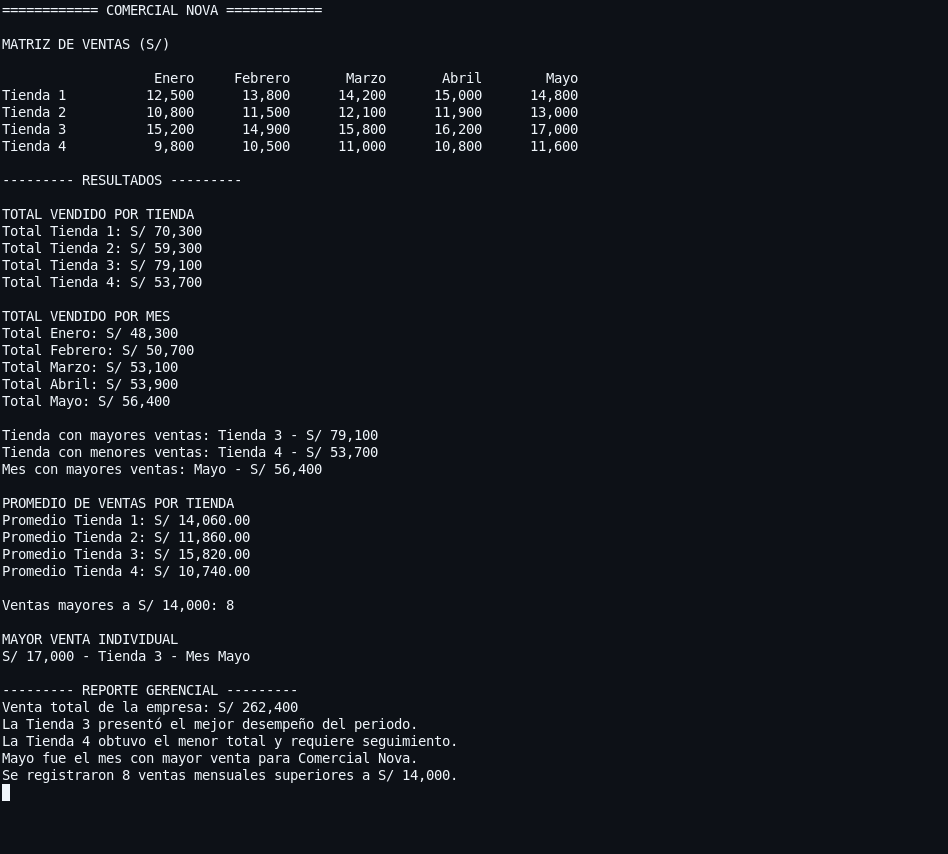

# Comercial Nova: análisis de ventas con matrices

**Curso:** Algoritmos y Estructuras de Datos  
**Semana:** 4  
**Estudiante:** Max Benites  
**Fecha:** 31 de agosto de 2026

## 1. Descripción del problema

Comercial Nova cuenta con cuatro tiendas y necesita analizar las ventas registradas durante cinco meses. Para representar la información se utilizó una matriz bidimensional de `4 x 5`: cada fila representa una tienda y cada columna representa un mes.

## 2. Estructura de la matriz

| | Enero | Febrero | Marzo | Abril | Mayo |
|---|---:|---:|---:|---:|---:|
| Tienda 1 | 12 500 | 13 800 | 14 200 | 15 000 | 14 800 |
| Tienda 2 | 10 800 | 11 500 | 12 100 | 11 900 | 13 000 |
| Tienda 3 | 15 200 | 14 900 | 15 800 | 16 200 | 17 000 |
| Tienda 4 | 9 800 | 10 500 | 11 000 | 10 800 | 11 600 |

## 3. Estrategia de solución

1. Almacenar las ventas en una matriz de números enteros.
2. Recorrer la matriz con dos ciclos anidados.
3. Acumular simultáneamente los totales de cada tienda y de cada mes.
4. Contar los valores mayores a S/ 14 000 y localizar la venta individual más alta.
5. Comparar los totales para encontrar la tienda con mayor venta, la tienda con menor venta y el mejor mes.
6. Dividir el total de cada tienda entre los cinco meses para obtener su promedio.
7. Presentar la matriz, los resultados y un reporte gerencial.

## 4. Resultados obtenidos

| Indicador | Resultado |
|---|---:|
| Total Tienda 1 | S/ 70 300 |
| Total Tienda 2 | S/ 59 300 |
| Total Tienda 3 | S/ 79 100 |
| Total Tienda 4 | S/ 53 700 |
| Tienda con mayores ventas | Tienda 3 |
| Tienda con menores ventas | Tienda 4 |
| Mes con mayores ventas | Mayo: S/ 56 400 |
| Ventas mayores a S/ 14 000 | 8 registros |
| Mayor venta individual | S/ 17 000, Tienda 3, mayo |
| Total general de la empresa | S/ 262 400 |

Promedios mensuales por tienda:

- Tienda 1: S/ 14 060,00.
- Tienda 2: S/ 11 860,00.
- Tienda 3: S/ 15 820,00.
- Tienda 4: S/ 10 740,00.

## 5. Código fuente

```{.java include="Main.java"}
```

## 6. Evidencia de funcionamiento

La siguiente captura muestra la compilación ejecutada correctamente y el reporte completo generado por el programa:

{width=7in}

## 7. Conclusión gerencial

Durante los cinco meses, Comercial Nova obtuvo ventas por S/ 262 400. La Tienda 3 presentó el mejor desempeño con S/ 79 100, mientras que la Tienda 4 registró el menor total con S/ 53 700 y requiere seguimiento. Mayo fue el mes más favorable para la empresa con S/ 56 400. La mayor venta mensual individual fue de S/ 17 000 y ocurrió en la Tienda 3 durante mayo.
