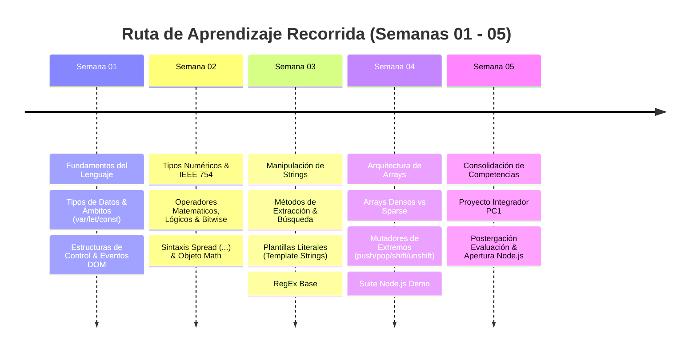

# Bitácora de Avance Curricular y Técnico — JavaScript Avanzado
## Asignatura: JavaScript Avanzado (`100000S51T`) — Ciclo VI (UTP)

**Especialista Responsable:** Max Anderson Benites Corazón (*Senior Technical Implementation Specialist — NCR VOYIX*)  
**Docente:** Mtro. Iván Robles Fernández  
**Corte de Estado:** Semana 05 (Septiembre de 2026)  
**Workspace:** [`/home/ilkay/Documentos/UTP/CICLO_VI/JAVASCRIPT_AVANZADO`](file:///home/ilkay/Documentos/UTP/CICLO_VI/JAVASCRIPT_AVANZADO)  

---

## 1. Resumen Ejecutivo del Estado del Curso

El programa de la asignatura abarca desde los fundamentos de la sintaxis moderna y el manejo de tipos primitivos hasta la arquitectura interna de memoria (vectores densos y no densos), manipulación avanzada de cadenas, análisis sintáctico con expresiones regulares (RegEx) y la transición hacia el ecosistema de backend con Node.js.



---

## 2. Matriz de Desglose por Semana Académica

| Semana | Eje Temático Principal | Conceptos Técnicos Clave | Proyectos / Código en Workspace |
| :--- | :--- | :--- | :--- |
| **[SEMANA01](file:///home/ilkay/Documentos/UTP/CICLO_VI/JAVASCRIPT_AVANZADO/SEMANA01)** | Fundamentos & Sintaxis Base | Tipos primitivos/objetos, `var` vs `let`/`const`, hoisting, `try-catch-finally`, handlers de eventos en el DOM (`onclick`, `onchange`). | [`SEMANA01/MATERIALES/`](file:///home/ilkay/Documentos/UTP/CICLO_VI/JAVASCRIPT_AVANZADO/SEMANA01/MATERIALES/) (Sesión 1 y Taller Sesión 2) |
| **[SEMANA02](file:///home/ilkay/Documentos/UTP/CICLO_VI/JAVASCRIPT_AVANZADO/SEMANA02)** | Números, Operadores & Spread | Precisión de coma flotante, operadores lógicos/cortocircuito, operadores a nivel de bits (`&`, `\|`, `^`, `<<`, `>>`), sintaxis Spread (`...`), métodos de `Math`. | [`SEMANA02/MATERIALES/`](file:///home/ilkay/Documentos/UTP/CICLO_VI/JAVASCRIPT_AVANZADO/SEMANA02/MATERIALES/) (`S02-ArreglosOperadores.rar`) |
| **[SEMANA03](file:///home/ilkay/Documentos/UTP/CICLO_VI/JAVASCRIPT_AVANZADO/SEMANA03)** | Cadenas de Texto & RegEx | Inmutabilidad de strings, extracción (`slice`, `substring`), búsqueda (`indexOf`, `includes`), Template Literals, introducción a RegEx (`test`, `match`, `replace`). | [`SEMANA03/MATERIALES/`](file:///home/ilkay/Documentos/UTP/CICLO_VI/JAVASCRIPT_AVANZADO/SEMANA03/MATERIALES/) (Sesión 1 y Taller Sesión 2) |
| **[SEMANA04](file:///home/ilkay/Documentos/UTP/CICLO_VI/JAVASCRIPT_AVANZADO/SEMANA04)** | Arreglos: Densidad & Mutación | Instanciación de vectores, arreglos densos vs *sparse* (huecos en memoria), propiedad `length`, manipulación con `push()`, `pop()`, `shift()`, `unshift()`, `join()`. | [`SEMANA04/js-arreglos-demo/`](file:///home/ilkay/Documentos/UTP/CICLO_VI/JAVASCRIPT_AVANZADO/SEMANA04/js-arreglos-demo/) (Proyecto modular Node con test suite) |
| **[SEMANA05](file:///home/ilkay/Documentos/UTP/CICLO_VI/JAVASCRIPT_AVANZADO/SEMANA05)** | Consolidación PC1 & Transición | Integración de formularios, validaciones RegEx en tiempo real, manipulación dinámica del DOM, buffer de objetos, reprogramación de evaluación. | [`SEMANA05/GUIA_ESTUDIO_PC1.md`](file:///home/ilkay/Documentos/UTP/CICLO_VI/JAVASCRIPT_AVANZADO/SEMANA05/GUIA_ESTUDIO_PC1.md) y [`SEMANA05/practica-integrada/`](file:///home/ilkay/Documentos/UTP/CICLO_VI/JAVASCRIPT_AVANZADO/SEMANA05/practica-integrada/) |

---

## 3. Análisis Técnico Detallado por Semana

### 🔹 Semana 01 — Fundamentos y Modelo de Ejecución
* **Tipos de Datos:**
  * Primitivos: `number`, `string`, `boolean`, `null`, `undefined`, `symbol`, `bigint`.
  * Complejos / Referencia: `object`, `function`, `Array`.
* **Manejo de Variables:**
  * `var`: Alcance de función (*function-scoped*), sujeto a *hoisting* con inicialización implícita en `undefined`.
  * `let` y `const`: Alcance de bloque (*block-scoped*), sujetos a Zona Muerta Temporal (*Temporal Dead Zone* - TDZ). `const` asegura inmutabilidad de binding, no del contenido en estructuras complejas.
* **Control de Flujo:**
  * Bifurcaciones: `if / else if / else`, operador ternario `cond ? a : b`, switch de coincidencia estricta (`===`).
  * Bucles: `for`, `while`, `do-while`, iteradores sobre propiedades/elementos.
  * Resiliencia: `try { ... } catch (error) { ... } finally { ... }`.
* **Event Loop & DOM:**
  * Enlace de escuchadores mediante atributos en línea (`onclick`, `onchange`) y mediante API DOM (`addEventListener`).

---

### 🔹 Semana 02 — Aritmética, Operadores Lógicos, Bitwise y Sintaxis Spread
* **Representación Numérica:**
  * Estándar IEEE 754 (doble precisión, 64 bits). Particularidades de redondeo (ej. `0.1 + 0.2 !== 0.3`).
  * Valores especiales: `NaN` (`Number.isNaN()`), `+Infinity`, `-Infinity`.
* **Operadores Avanzados:**
  * Operadores de bits: Desplazamiento a la izquierda (`<<`), desplazamiento a la derecha con signo (`>>`), desplazamiento sin signo (`>>>`), operaciones lógicas bit a bit (`&`, `|`, `^`, `~`).
  * Asignación lógica moderna: `&&=`, `||=`, `??=` (Nullish Coalescing Assignment).
* **Sintaxis Spread (`...`) & Rest:**
  * Desempaquetado de iterables para clonado superficial (*shallow copy*) de arreglos y combinación de objetos literales: `const copy = [...arr]`.
  * Parámetros rest en funciones para captura dinámica de argumentos.
* **Objeto `Math`:**
  * Redondeo: `Math.floor()`, `Math.ceil()`, `Math.round()`, `Math.trunc()`.
  * Aritmética y aleatoriedad: `Math.random()`, `Math.max()`, `Math.min()`, `Math.pow()`, `Math.sqrt()`.

---

### 🔹 Semana 03 — Manipulación de Cadenas de Texto & Introducción a RegEx
* **Inmutabilidad de Cadenas:**
  * Los tipos primitivos string no mutan en memoria; cada método genera una nueva instancia.
* **Métodos Clave del Prototipo `String`:**
  * Extracción: `slice(start, end)` (soporta índices negativos relativos al final) vs `substring(start, end)` (normaliza argumentos si `start > end`).
  * Búsqueda e inspección: `indexOf()`, `lastIndexOf()`, `includes()`, `startsWith()`, `endsWith()`.
  * Formateo y transformación: `toUpperCase()`, `toLowerCase()`, `trim()`, `trimStart()`, `trimEnd()`, `split()`, `replace()`.
* **Plantillas Literales (*Template Literals*):**
  * Delimitación por comillas invertidas (`` `...` ``).
  * Soporte nativo multilínea e interpolación de expresiones mediante `${expresión}`.
* **Expresiones Regulares (`RegExp`):**
  * Sintaxis literal `/patrón/flags` vs constructor `new RegExp('patrón', 'flags')`.
  * Banderas comunes: `g` (global), `i` (case-insensitive), `m` (multilínea).
  * Metacaracteres y cuantificadores: `\d` (dígitos), `\s` (espacios en blanco), `\w` (alfanumérico), `+` (1 a más), `*` (0 a más), `?` (0 o 1), `^` (ancla de inicio), `$` (ancla de fin).
  * Métodos de evaluación: `RegExp.prototype.test()`, `String.prototype.match()`, `String.prototype.replace()`.

---

### 🔹 Semana 04 — Estructuras de Arreglos (Densidad, Memoria y Métodos de Cola/Pila)
* **Instanciación y Representación:**
  * Literales: `const arr = [1, 2, 3]`.
  * Constructor: `new Array(3)` (crea 3 huecos o *empty slots*) vs `[3]` / `Array.of(3)` (crea un vector con longitud 1 y valor 3).
* **Arreglos Densos vs No Densos (*Sparse Arrays*):**
  * **Denso:** Los índices de `0` hasta `length - 1` están definidos consecutivamente como claves en memoria.
  * **No Denso (*Sparse*):** Presenta huecos causados por elisión (`[1, , 3]`), uso del operador `delete` (elimina el slot pero mantiene el `length`), o asignaciones en índices dispersos (`arr[100] = 'val'`).
  * Comportamiento iterativo: Métodos como `forEach()`, `map()` y `filter()` omiten los huecos, mientras que `for...of` y `Array.from()` los materializan como `undefined`.
* **Métodos Mutadores de Extremos:**
  * Pila (LIFO): `push(el)` (agrega al final) y `pop()` (remueve del final).
  * Cola (FIFO): `unshift(el)` (agrega al inicio reindexando) y `shift()` (extrae del inicio reindexando).
* **Serialización:**
  * `join(separator)` y `toString()`.
* **Proyecto Implementado:**
  * Módulo ejecutable en [`SEMANA04/js-arreglos-demo/`](file:///home/ilkay/Documentos/UTP/CICLO_VI/JAVASCRIPT_AVANZADO/SEMANA04/js-arreglos-demo/) con pruebas unitarias nativas de Node.js (`npm test` / `node --test`).

---

### 🔹 Semana 05 — Consolidación para la PC1 y Sesión del Lunes 07/09
* **Temario Oficial Evaluativo (Slide `S05_s1`):**
  * Integración completa de Arreglos (densos/no densos), Cadenas (operaciones, interpolación) y RegEx.
* **Proyecto Desarrollado:**
  * Implementación completa en [`SEMANA05/practica-integrada/`](file:///home/ilkay/Documentos/UTP/CICLO_VI/JAVASCRIPT_AVANZADO/SEMANA05/practica-integrada/):
    * **Formulario Interactivo:** Captura de Nombres, Apellidos, Lugar de Nacimiento, Dirección, Universidad y Seguro (`Essalud` o `EPS`).
    * **Validaciones RegEx:** Validación estricta de nombres y texto con tildes (`/^[a-zA-ZáéíóúÁÉÍÓÚñÑ\s]+$/`) y seguro (`/^(Essalud|EPS)$/i`).
    * **Demostración de Métodos de String:** Extracción dinámica con `slice()`, `substring()`, `indexOf()`, `includes()`, normalización y render con plantillas literales.
    * **Vector de Registros:** Acumulación en arreglo denso, visualización de longitud (`arr.length`) y listado reactivo.
    * **Algoritmo Numérico:** Módulo complementario de sumatoria de valores hasta ingreso de cero (`0`).
* **Hito de la Sesión en Vivo (Lunes 07 de Septiembre):**
  * El docente **postergó la fecha de evaluación de la PC1** para la semana entrante.
  * Se inició de manera adelantada el temario de **Node.js** ([`SEMANA06/MATERIALES/S06_s1 - JavaScript Avanzado - NodeJS.pdf`](file:///home/ilkay/Documentos/UTP/CICLO_VI/JAVASCRIPT_AVANZADO/SEMANA06/MATERIALES/S06_s1%20-%20JavaScript%20Avanzado%20-%20NodeJS.pdf)), abordando:
    1. Módulo del sistema operativo (`os`).
    2. Servidor web HTTP con el módulo core `http`.
    3. Servidor de sockets TCP con el módulo core `net`.

---

## 4. Estructura de Proyectos y Recursos en el Repositorio

```text
JAVASCRIPT_AVANZADO/
├── AVANCE_SEMANA01_A_SEMANA05.md       <-- [Este informe de estado]
├── README.md                           <-- Descripción general del curso
├── SEMANA01/
│   └── MATERIALES/                     <-- PDFs oficiales de Introducción y Taller
├── SEMANA02/
│   └── MATERIALES/                     <-- PDFs de Operadores y Archivo RAR
├── SEMANA03/
│   └── MATERIALES/                     <-- PDFs de Cadenas y Taller
├── SEMANA04/
│   ├── MATERIALES/                     <-- PDFs de Arreglos
│   └── js-arreglos-demo/               <-- Demo interactiva y tests unitarios
│       ├── package.json
│       ├── src/ (01-densos, 02-no-densos, 03-shift-unshift, index.js)
│       └── test/ (suite node --test)
├── SEMANA05/
│   ├── GUIA_ESTUDIO_PC1.md             <-- Guía metodológica para la sustentación PC1
│   ├── MATERIALES/                     <-- Diapositiva S05_s1 de Evaluación
│   ├── Práctica Calificada 1...pdf     <-- Examen modelo 2025 (MiniPortal de Noticias)
│   ├── practica-integrada/             <-- Solución web completa para el examen
│   └── pc1-miniportal-noticias/        <-- Solución al examen modelo 2025 (NewsAPI + Auth)
└── SEMANA06/
    └── MATERIALES/                     <-- S06_s1: Introducción a Node.js y TypeScript
```

---

## 5. Próximos Hitos y Acciones Inmediatas

1. **Rendición de la Práctica Calificada 1 (PC1):**
   * Sustentación del proyecto [`SEMANA05/practica-integrada/`](file:///home/ilkay/Documentos/UTP/CICLO_VI/JAVASCRIPT_AVANZADO/SEMANA05/practica-integrada/) frente al docente.
   * Dominio de las justificaciones técnicas (diferencia entre `new Array(n)` y `[n]`, comportamiento del operador `delete` en matrices no densas, y validación con expresiones regulares).
2. **Consolidación en Node.js (Semana 06):**
   * Desarrollo de los tres ejercicios solicitados por el docente: invocación de métodos de `os`, servidor `http.createServer` y servidor TCP con `net.createServer`.
