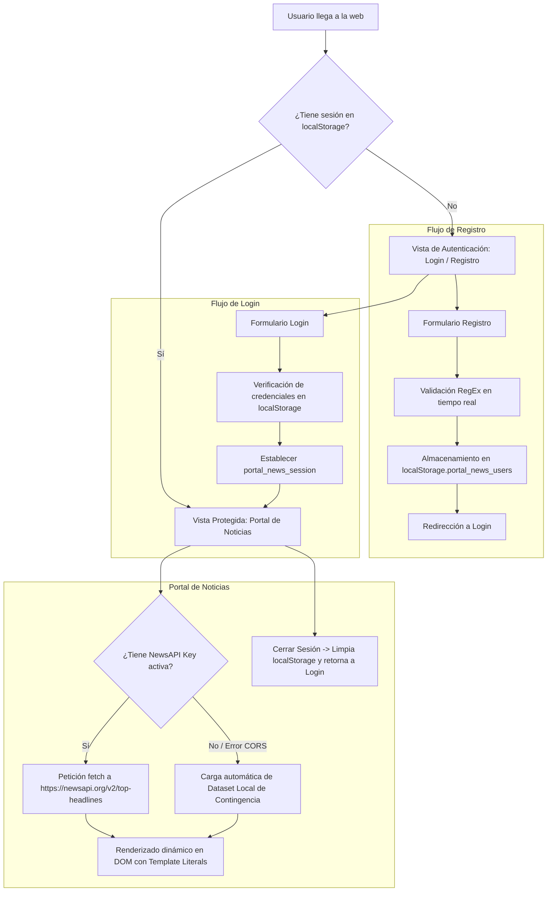

# MiniPortal de Noticias — Práctica Calificada 1 (PC1)

**Asignatura:** JavaScript Avanzado (`100000S51T`) — Ciclo VI (UTP)  
**Especialista Responsable:** Max Anderson Benites Corazón (*Senior Technical Implementation Specialist — NCR VOYIX*)  
**Docente:** Mtro. Iván Robles Fernández  
**Caso de Negocio:** Desarrollo de Portal Web de Noticias con Autenticación Simulada y Consumo de API Externa  
**Documento Base:** [`SEMANA05/Práctica Calificada 1 JavaScript Avanzado UTP - 2025docx_IBHLIN.pdf`](file:///home/ilkay/Documentos/UTP/CICLO_VI/JAVASCRIPT_AVANZADO/SEMANA05/Pr%C3%A1ctica%20Calificada%201%20JavaScript%20Avanzado%20UTP%20-%202025docx_IBHLIN.pdf)

---

## 1. Descripción del Proyecto y Arquitectura

El proyecto implementa una solución completa tipo Single Page Application (SPA) orientada al cumplimiento exhaustivo de los requerimientos de la **Práctica Calificada 1 (PC1)**:



---

## 2. Matriz de Cumplimiento de Requerimientos

| Requerimiento Oficial | Implementación Técnica | Ubicación en Código |
| :--- | :--- | :--- |
| **1. Registro de Usuario** | Formulario con validación en cliente de: <br>• Nombre completo (mínimo 3 caracteres)<br>• Correo electrónico (RegEx RFC)<br>• Contraseña (mínimo 6 caracteres alfanumérico)<br>• Confirmar contraseña (igualdad estricta) | [`app.js`](file:///home/ilkay/Documentos/UTP/CICLO_VI/JAVASCRIPT_AVANZADO/SEMANA05/pc1-miniportal-noticias/app.js) (`REGEX_RULES`, `Validator`, `handleRegister`) |
| **Persistencia de Usuarios** | Guardado de array de objetos en `localStorage.getItem('portal_news_users')` serializado con `JSON.stringify()`. | [`app.js`](file:///home/ilkay/Documentos/UTP/CICLO_VI/JAVASCRIPT_AVANZADO/SEMANA05/pc1-miniportal-noticias/app.js) (`StorageService`) |
| **2. Inicio de Sesión Simulado** | Validación de credenciales contra `localStorage`. Genera sesión en `portal_news_session` con timestamp y bandera `isLoggedIn = true`. | [`app.js`](file:///home/ilkay/Documentos/UTP/CICLO_VI/JAVASCRIPT_AVANZADO/SEMANA05/pc1-miniportal-noticias/app.js) (`handleLogin`) |
| **3. Página de Noticias Protegida** | Control de acceso: Si no está autenticado, oculta las noticias y muestra login. Si está autenticado, muestra navbar con nombre y botón de salida. | [`app.js`](file:///home/ilkay/Documentos/UTP/CICLO_VI/JAVASCRIPT_AVANZADO/SEMANA05/pc1-miniportal-noticias/app.js) (`checkCurrentSession`, `renderAuthenticatedUI`) |
| **Consumo de NewsAPI** | Consumo vía `fetch('https://newsapi.org/v2/top-headlines?country=us&apiKey=...')` usando `async/await`. | [`app.js`](file:///home/ilkay/Documentos/UTP/CICLO_VI/JAVASCRIPT_AVANZADO/SEMANA05/pc1-miniportal-noticias/app.js) (`NewsController.loadNews`) |
| **Renderizado en DOM** | Inyección de tarjetas con: <br>• **Título**<br>• **Descripción**<br>• **Imagen** (con fallback en caso de error 404)<br>• **Enlace** directo a la noticia | [`app.js`](file:///home/ilkay/Documentos/UTP/CICLO_VI/JAVASCRIPT_AVANZADO/SEMANA05/pc1-miniportal-noticias/app.js) (`renderArticles`) |
| **Resiliencia / Contingencia** | El plan gratuito de NewsAPI suele bloquear peticiones client-side directas por política CORS o HTTP 426. El sistema detecta esto y conmuta automáticamente a un dataset de respaldo para garantizar sustentación sin fallos. | [`app.js`](file:///home/ilkay/Documentos/UTP/CICLO_VI/JAVASCRIPT_AVANZADO/SEMANA05/pc1-miniportal-noticias/app.js) (`FALLBACK_NEWS`, `renderFallback`) |

---

## 3. Estructura de Archivos

```text
pc1-miniportal-noticias/
├── index.html       # Estructura semántica, formularios de login/registro y grid de noticias
├── styles.css       # Diseño moderno con CSS Variables, Grid responsivo y estados de validación
├── app.js           # Lógica modular: AuthController, NewsController, StorageService, Validator
└── README.md        # Documentación técnica y guía de sustentación
```

---

## 4. Instrucciones de Ejecución y Prueba Local

### Opción A: Servidor HTTP Local (Recomendado)
Para evitar restricciones de orígenes cruzados en navegadores estrictos:
```bash
# Desde este directorio:
npx serve .
# O utilizando Python:
python3 -m http.server 8080
```
Abrir en el navegador: `http://localhost:8080` (o el puerto indicado).

### Opción B: Apertura Directa
Abrir el archivo [`index.html`](file:///home/ilkay/Documentos/UTP/CICLO_VI/JAVASCRIPT_AVANZADO/SEMANA05/pc1-miniportal-noticias/index.html) directamente en Google Chrome (`Profile 1`).

---

## 5. Guía de Sustentación Técnica ante el Docente

### Pregunta 1: ¿Cómo garantizas la validación de formato de correo y contraseñas?
> *"Utilizamos expresiones regulares formales probadas en el evento `input` y al dispararse el `submit`. Para el email usamos `/^[a-zA-Z0-9._%+-]+@[a-zA-Z0-9.-]+\.[a-zA-Z]{2,}$/`, y para la contraseña usamos un lookahead positivo `^(?=.*[a-zA-Z])(?=.*\d)` para certificar que contenga al menos una letra y un número con una longitud mínima de 6 caracteres."*

### Pregunta 2: ¿Cómo persiste el usuario si no tenemos un backend?
> *"Aprovechamos la API de `localStorage` del navegador. Al registrarse, serializamos el arreglo de usuarios con `JSON.stringify()` bajo la clave `portal_news_users`. Al iniciar sesión, buscamos el registro con el método `find()` de los arreglos y establecemos un token de sesión en `portal_news_session` con `isLoggedIn: true`."*

### Pregunta 3: ¿Por qué la llamada directa a NewsAPI a veces falla en navegadores?
> *"El plan para desarrolladores (*Developer Plan*) de `newsapi.org` restringe las peticiones directas desde el navegador (CORS / HTTP 426 Upgrade Required) para forzar su consumo desde entornos backend (Node.js). Por esa razón, nuestra arquitectura implementa un bloque `try/catch` asíncrono que, ante cualquier bloqueo de red o falta de API Key, activa un dataset mock de contingencia de forma transparente, garantizando que el portal nunca quede en blanco."*
