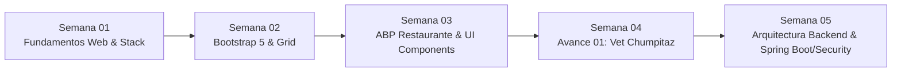

# Consolidado de Avance Curricular: Semanas 01 a 05
## Curso: Marcos de Desarrollo Web (`100000S52T`) - Ciclo VI UTP

**Especialista Responsable:** Max Anderson Benites Corazón (*Senior Technical Implementation Specialist*)  
**Docente:** Hernán Francisco Peña Carnero  
**Ciclo Académico:** 2026-II (Ciclo VI)  
**Fecha de consolidación:** Septiembre 2026  

---

## 📌 1. Visión General del Progreso Formativo

Durante estas cinco primeras semanas, la asignatura ha desarrollado una transición integral desde los fundamentos del diseño frontend responsivo estructurado y componentes declarativos, hasta la conceptualización de arquitecturas cliente-servidor completas, abarcando la capa de backend moderna, inyección de dependencias, servicios REST y capas de seguridad.

---

## 📂 2. Desglose Detallado por Semana

### 🔹 SEMANA 01: Fundamentos Front-end y Ecosistema de Tecnologías Web
- **Ejes Conceptuales:**
  - **Sitio Web Estático vs. Dinámico:**
    - *Estático:* Servido directamente desde el sistema de archivos (HTML, CSS, JS plano).
    - *Dinámico:* Renderizado en servidor o cliente mediante lógica de procesamiento, bases de datos y APIs.
  - **HTML5 Semántico y Estructura:**
    - Declaración `<html lang="es">`, juego de caracteres `<meta charset="UTF-8">`.
    - Etiquetas semánticas: `<header>`, `<nav>` (bloques de navegación/menú), `<main>`, `<section>`, `<article>`, `<footer>`.
  - **CSS3 y Modelo de Caja:**
    - Inclusión externa mediante `<link rel="stylesheet" href="...">`.
    - Dimensionamiento (`content`, `padding`, `border`, `margin`), jerarquías y selectores.
  - **Ecosistema de Preprocesadores y Frameworks:**
    - **Sass / SCSS:** Preprocesador con variables (`$`), anidamiento, mixins y módulos.
    - **LESS:** Preprocesador con variables (`@`), mixins y operaciones matemáticas.
    - **jQuery:** Librería para manipulación de DOM y peticiones Ajax simples.
    - **React, Angular, Vue:** Modelos de componentes, reactividad, data-binding y SPAs.
- **Entregables y Prácticas Locales:**
  - `Practica_Tarea2.pdf`: Informe comparativo de tecnologías cliente/servidor (Grupo 5: Max Anderson Benites Corazón & Peter Mendoza Pérez).
  - Proyecto práctico maquetado: `SEMANA01/proyecto15`.

---

### 🔹 SEMANA 02: Framework de Diseño Front-end – Bootstrap 5
- **Ejes Conceptuales:**
  - **Integración vía CDN:**
    - Hoja de estilos: `bootstrap.min.css`.
    - Lógica de componentes interactivos con Popper integrado: `bootstrap.bundle.min.js`.
  - **Controles de Formularios y Clases Utilitarias:**
    - Clases `.form-label`, `.form-control`, `.form-text`, `.form-check`, `.form-check-input`.
    - Espaciados y márgenes responsivos (`mb-3`, `pe-3`, `mt-3`, etc.).
  - **Sistemas de Navegación Avanzada:**
    - Barra de navegación (`.navbar`, `.navbar-dark`, `.bg-dark`, `.fixed-top`).
    - Navegación lateral oculta moderna (`.offcanvas`, `.offcanvas-end`, `.offcanvas-body`, `.offcanvas-title`, `.btn-close`).
    - Elementos dinámicos: menús desplegables (`.dropdown`, `.dropdown-menu`).
- **Archivos Clave Desarrollados:**
  - `SEMANA02/index.html`: Implementación de formularios con validación y estilos Bootstrap.
  - `SEMANA02/index2.html`: Barra de navegación con componente Offcanvas interactivo.

---

### 🔹 SEMANA 03: Aprendizaje Basado en Problemas (ABP) – Solución Real con Bootstrap
- **Ejes Conceptuales:**
  - Solución a una problemática de negocio: digitalización de un emprendimiento gastronómico local en 40 minutos.
  - **Estructura Grid y Responsive:** Contenedores fluidos (`.container`), filas (`.row`) y columnas (`.col-*`) basadas en 12 columnas.
  - **Componentes de Conversión:**
    - Tarjetas de presentación (`.card`, `.card-img-top`, `.card-body`, `.card-title`).
    - Ventanas modales (`.modal`, `.modal-dialog`, `.modal-content`) para detalles y términos.
    - Formulario de reservas y contacto interactivo con JavaScript (`script.js`).
- **Entregables y Proyectos:**
  - `SEMANA03/ACTIVIDAD DE APRENDIZAJE BASADO EN PROBLEMAS.docx`: Documento del reto formativo.
  - `SEMANA03/Restaurante-Sabor-Peruano/`: Sitio web responsivo completo implementado con maquetación en HTML5, estilos en `css/estilos.css` y lógica de control interactiva en `js/script.js`.

---

### 🔹 SEMANA 04: Avance 01 del Proyecto Integrador – Plataforma Veterinaria "Chumpitaz"
- **Ejes Conceptuales y Metodología:**
  - **Proyecto de Curso:** *Desarrollo de una plataforma web para la gestión de citas, servicios y atención al cliente de la Veterinaria “Chumpitaz”*.
  - **Modelado del Negocio:**
    - Identificación del rubro médico veterinario, diagnóstico de la problemática operativa (canales manuales / telefónicos).
    - Objetivos generales y específicos: accesibilidad 24/7, catálogo de servicios, calendarización de citas, reducción de inasistencias.
    - Alcances del sistema y limitaciones operativas.
  - **Diseño de Interfaz & Maquetación UX/UI:**
    - Elaboración de maquetas de alta fidelidad:
      1. Vista Principal / Inicio (`01_Inicio.png`).
      2. Servicios y Productos (`02_Servicios_Productos.png`).
      3. Módulo de Reserva de Citas (`03_Reserva_Cita.png`).
      4. Panel Administrativo (`04_Panel_Administrativo.png`).
      5. Diseño Responsivo Mobile (`05_Vista_Responsive.png`).
- **Entregables Principales:**
  - Documentos técnicos: `Avance01_Veterinaria_Chumpitaz.docx` y `Avance01_Veterinaria_Chumpitaz.pdf`.
  - Diapositivas de sustentación: `Avance01_Veterinaria_Chumpitaz.pptx`.
  - Prototipo HTML maquetado: `SEMANA04/MEJORADO/MAQUETAS/maquetas.html`.

---

### 🔹 SEMANA 05: Arquitectura Backend, Servicios REST y Seguridad Web (Spring Boot & Spring Security)
- **Ejes Conceptuales Evaluados:**
  - **Ecosistema Spring Boot:**
    - Inicialización de proyectos mediante **Spring Initializr** (interfaz web y API REST vía `curl`) y **Spring Tools 4 for Eclipse (STS4)**.
    - Principio de **Autoconfiguración** y *Convention over Configuration*, reduciendo drásticamente la configuración manual de XMLs.
    - **Inyección de Dependencias (IoC):** Uso de la anotación `@Autowired` para desacoplar componentes del contenedor.
    - **Controladores REST:**
      - `@RestController`: Expone endpoints y serializa directamente respuestas HTTP (JSON).
      - `@GetMapping`: Mapeo declarativo para solicitudes HTTP GET.
  - **Capa de Persistencia y Datos:**
    - **Spring Data:** Abstracción unificada sobre almacenes relacionales y NoSQL mediante interfaces tipo `Repository` (`CrudRepository`, `JpaRepository`).
  - **Seguridad Web & Interceptación (Spring Security):**
    - **Autenticación vs. Autorización:**
      - *Autenticación:* Reconocimiento y validación de la identidad del usuario (usuario por defecto: `user`).
      - *Autorización:* Determinación de qué operaciones y recursos tiene permitido ejecutar el usuario autenticado.
    - **Cadena de Filtros (Servlet Filters):**
      - Objetos que interceptan solicitudes y respuestas antes o después de llegar al servlet de destino.
      - Comportamiento configurable: no todos los filtros se ejecutan de manera obligatoria para cada ruta.
    - **Seguridad por Defecto:**
      - Spring Security protege automáticamente todos los endpoints a menos que se definan explícitamente como públicos (`permitAll()`).
    - **Seguridad a Nivel de Métodos:**
      - `@EnableMethodSecurity`: Habilita la evaluación de seguridad por métodos.
      - `@PreAuthorize`: Restringe el acceso a un método validando roles/permisos (`hasRole('ADMIN')`) antes de su ejecución.
      - **Authorities:** Permisos o privilegios expresados como cadenas de texto descriptivas.

---

## 📊 3. Matriz Sinóptica de Aprendizaje (Semanas 01 a 05)

| Semana | Módulo / Eje Temático | Tecnologías Involucradas | Entregable / Producto Clave |
| :---: | :--- | :--- | :--- |
| **01** | Fundamentos Front-end y Preprocesadores | HTML5, CSS3, JS, Sass, LESS | Práctica Investigativa (Tarea 2) y Proyecto 15 |
| **02** | Diseño y Componentes Responsivos | Bootstrap 5, Offcanvas, Navbar | Prototipos de formulario y menú responsivo |
| **03** | Aprendizaje Basado en Problemas | Bootstrap 5, Modales, Cards, Grid | Web "Restaurante Sabor Peruano" |
| **04** | Arquitectura y Diseño de Plataforma | Maquetación UI/UX, Mobile First | **Avance 01:** Plataforma Veterinaria Chumpitaz |
| **05** | Backend REST & Seguridad en Capas | Java, Spring Boot, Spring Security | Servicios REST, filtros y control de acceso (Auth) |

---
*Documento estructurado conforme al perfil profesional de Max Anderson Benites Corazón.*
